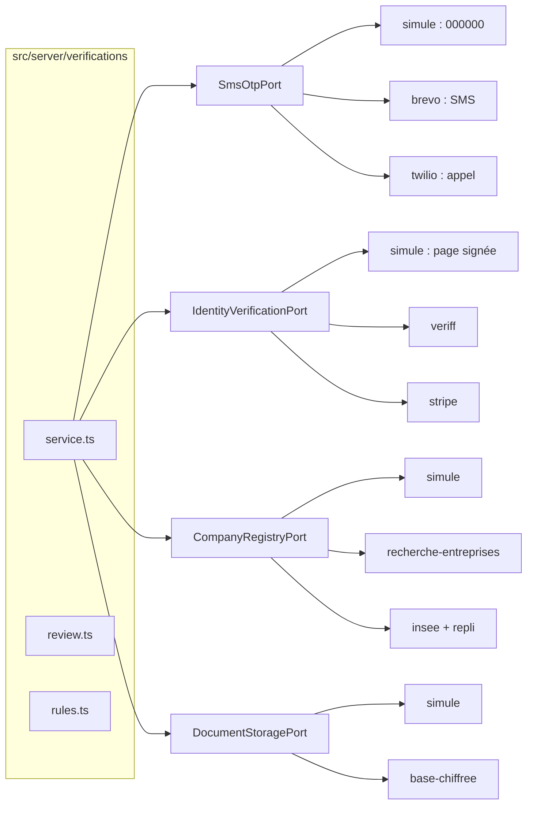

# Intégrations de la vérification de l'accompagnant (lot L2)

> Décision : [ADR 0009](../adr/0009-verification-identite.md). Étude : [`L2-verification-identite.md`](../L2-verification-identite.md). Notes : [`L2-I-notes.md`](../L2-I-notes.md).
> Règle d'or : chaque service externe passe par un **port** (`src/server/ports/verification.ts`) et un **adaptateur** (`src/server/adapters/**`). Adaptateur **simulé** par défaut. Aucune clé dans le dépôt.

## 1. Vue d'ensemble

| Port | Variable | Adaptateurs | Simulé fait quoi | Simulé en lancement |
|---|---|---|---|---|
| `SmsOtpPort` (SMS) | `ADAPTER_OTP` | `simule`, `brevo` | Code fixe `000000`, rien n'est envoyé | Fermé → l'opérateur vérifie par appel |
| `SmsOtpPort` (appel) | `ADAPTER_OTP_APPEL` | `simule`, `twilio` | Rien n'est appelé | Fermé |
| `IdentityVerificationPort` | `ADAPTER_IDENTITY` | `simule`, `veriff`, `stripe` | Page `/verification/simulee`, 4 boutons, webhook HMAC | Page et webhook absents (404) → visio |
| `CompanyRegistryPort` | `ADAPTER_SIRENE` | `simule`, `recherche-entreprises`, `insee` | SIRET de test (`SIMULATED_SIRETS`) | « Registre muet » → document demandé |
| `DocumentStoragePort` | `ADAPTER_DOCUMENTS` | `simule`, `base-chiffree` | Clé de développement publique | Fermé → document montré en visio |

**Écart avec l'étude § 8.1 :** `SmsOtpPort.deliver()` livre un code **généré et contrôlé par Koudmen** (empreinte HMAC, 10 min, 5 essais). Brevo ne sait pas contrôler un code.

## 2. Contrats des fournisseurs (tests contractuels)

Fichier : `src/server/adapters/adapters.contract.test.ts`. Réponses enregistrées : `src/server/adapters/__enregistrements__/reponses.ts`. **Aucun appel réseau.**

| Fournisseur | Requête | Signature / authentification | [À VÉRIFIER] avant l'ouverture |
|---|---|---|---|
| Brevo SMS | `POST https://api.brevo.com/v3/transactionalSMS/sms` `{ sender, recipient (sans +), content, type: transactional, tag }` | En-tête `api-key` | Prix réel vers `+596696`, expéditeur alphanumérique accepté |
| Twilio | `POST /2010-04-01/Accounts/{SID}/Calls.json` (`To`, `From`, `Twiml`) | Basic `SID:token` | Voix française, coût |
| Veriff | `POST {base}/v1/sessions` `{ verification: { callback, person, vendorData } }` | `X-AUTH-CLIENT` ; webhook `X-HMAC-SIGNATURE` = HMAC-SHA256 hex du corps brut | Nom exact de l'en-tête, table des `reasonCode`, API de suppression `DELETE /v1/sessions/{id}`, région |
| Stripe Identity | `POST /v1/identity/verification_sessions` (document, selfie, capture en direct) ; lecture `verified_outputs` | Bearer ; webhook `Stripe-Signature` (t, v1), tolérance 300 s | Conservation de la biométrie (1 an par défaut) |
| Recherche d'entreprises | `GET https://recherche-entreprises.api.gouv.fr/search?q={siret}` | Aucune | Champ de diffusion partielle, champs de l'entrepreneur individuel |
| INSEE Sirene | `GET https://api.insee.fr/api-sirene/3.11/siret/{siret}` | `X-INSEE-Api-Key-Integration` | Nom de l'en-tête du nouveau portail |

## 3. Webhooks

| Route | Contrôles |
|---|---|
| `POST /api/webhooks/identite/veriff` | HMAC sur le corps brut, temps constant, `X-AUTH-CLIENT` contrôlé s'il est présent |
| `POST /api/webhooks/identite/stripe` | `Stripe-Signature`, horodatage < 5 min |
| `POST /api/webhooks/identite/simule` | HMAC (`SIMULATED_WEBHOOK_SECRET`), horodatage < 5 min ; **404 en lancement** |

Règles communes : corps ≤ 64 Ko lu brut avant tout parsage ; idempotence `WebhookEvent (provider, providerEventId)` ; signature refusée → 401 + audit `identity.webhook_refused` ; réponse sans détail ; aucune image ni numéro de pièce dans un journal. Veriff ne donne pas d'horodatage d'envoi : la protection contre le rejeu est l'idempotence (écart avec l'étude § 8.2).

## 4. Données gardées

| Donnée | Où | Durée |
|---|---|---|
| Code SMS | Empreinte HMAC (`PhoneChallenge.codeHash`) | Ligne effacée après 24 h |
| Numéro vérifié | `User.phone` (format lisible) + `CaregiverProfile.phoneHash` (unique) | Vie du compte |
| Résultat d'identité | `IdentityCheck` : décision, type et pays de la pièce, 4 derniers caractères, empreinte HMAC du numéro, nom/date conformes, codes de risque | Relation + 5 ans |
| Images, selfie, biométrie | **Chez le prestataire seulement** ; suppression demandée 30 jours après la décision (purge nocturne) | — |
| Adresse déclarée | `CaregiverProfile.addressEnc` (AES-256-GCM, clé des documents) | Vie du compte |
| Justificatif, Kbis, RNE, avis Sirene | `SensitiveDocument.ciphertext` : clé par fichier chiffrée par `DOCUMENT_ENC_KEY` ; métadonnées EXIF/PNG retirées | Effacé 30 jours après la décision ; la ligne reste (`deletedAt`) |
| Accès opérateur | `DocumentAccessLog` + `AuditLog` (motif fermé) | Comme l'audit |

## 5. Passer au réel (ordre conseillé)

1. `ADAPTER_SIRENE=recherche-entreprises` (sans compte).
2. Brevo : crédits SMS + expéditeur → `ADAPTER_OTP=brevo`, `BREVO_SMS_SENDER`, `SMS_DAILY_BUDGET_CENTS`.
3. `DOCUMENT_ENC_KEY` + `ADAPTER_DOCUMENTS=base-chiffree` (Cellar plus tard : nouvel adaptateur `s3-chiffre`, même port).
4. Veriff (après DPA et AIPD) : clés + webhook → `ADAPTER_IDENTITY=veriff`. Rejouer les tests contractuels contre le bac à sable Veriff et mettre à jour les réponses enregistrées.
5. Twilio (appel vocal de repli) quand le compte existe.
