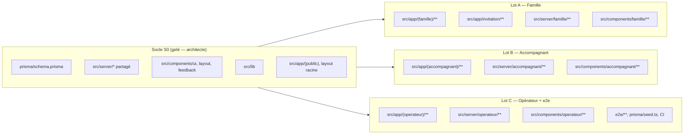

# Lots de travail du MVP — qui possède quoi

> **S1b (2026-10-04) :** les lots A, B et C sont fusionnés. Le sprint S1b a touché tous les dossiers (socle compris) pour appliquer D1 à D15. Nouveaux modules du **socle** : `src/server/scope.ts`, `src/server/matching/**`, `src/server/sandbox/**`, `src/server/ops/**`, `src/components/sandbox/**`, `src/components/legal/**`, `src/components/ui/use-form-action.tsx`, `src/lib/legal.ts`, `src/lib/measure.ts`, `scripts/**`. Voir `specification-mvp.md` § 14 et ADR 0003.

> **But :** 3 constructeurs travaillent **en parallèle** sans conflit.
> **Règle d'or :** tu modifies **seulement** les fichiers de ton lot. Pour tout autre fichier, demande à l'orchestrateur.
> Spécification : [`specification-mvp.md`](specification-mvp.md). Code : `plateforme/`.



## 1. Règles communes

1. **Aucune nouvelle dépendance.** Tout est installé (voir § 6). Besoin d'une dépendance ? Demande à l'orchestrateur.
2. **Schéma Prisma gelé.** Pas de migration sans accord de l'architecte. Le schéma couvre tout le MVP.
3. **Ne modifie pas le socle** (§ 5). Bug trouvé dans le socle → signale-le, ne le corrige pas toi-même.
4. **Avant de livrer**, exécute dans `plateforme/` : `pnpm lint && pnpm typecheck && pnpm test && pnpm build`. Tout doit être vert.
5. **Textes** : français, ~80 % ASD-STE100, **vouvoiement** pour l'utilisateur. Un terme = un sens : « accompagnant » (jamais « aidant » ou « intervenant »), « aîné », « famille », « visite », « Kayé », « cercle Lakou ».
6. **Données fictives** seulement, dans le code, les tests et les captures.

## 2. Lot A — Famille (`dev-frontend`)

**Écrans :** F1 à F10 (spec § 5.2).

| Possède (création et modification libres) |
|---|
| `plateforme/src/app/(famille)/**` (y compris `layout.tsx` et sa navigation) |
| `plateforme/src/app/invitation/**` |
| `plateforme/src/server/famille/**` (requêtes, actions, tests) |
| `plateforme/src/components/famille/**` |

**À faire :**
- Profil aîné + consentement (`generateUniqueHomeCode()`, centre de commune via `getCommune()`).
- Cercle Lakou + invitation (jeton aléatoire `crypto.randomBytes`, 14 jours).
- Demandes d'accompagnement (création, annulation).
- Visites + bouton « L'aîné a confirmé (appel simulé) » → `confirmElderSimulated()`.
- Fil Kayé.
- Formule (paiement simulé).
- Tests Vitest de la logique propre au lot (validation Zod, transformation de données).

## 3. Lot B — Accompagnant + visites + Kayé (`dev-backend`)

**Écrans :** A1 à A8 (spec § 5.3).

| Possède |
|---|
| `plateforme/src/app/(accompagnant)/**` (y compris `layout.tsx`) |
| `plateforme/src/server/accompagnant/**` |
| `plateforme/src/components/accompagnant/**` |

**À faire :**
- Orientation 5 questions → `orientCaregiver()` ; enregistre statut, niveaux (`allowedLevelsFor`), `VerificationItem`.
- Profil : communes, disponibilités, **tarif libre**.
- Vérifications déclaratives + « Demander la vérification » (`EN_ATTENTE`).
- Propositions : accepter (crée `Mission` + visites des 4 prochaines semaines, annule les autres propositions, demande `POURVUE`) / refuser **sans pénalité**.
- Visite : check-in GPS (une position) + code domicile → `evaluateGps()`, `verifyHomeCode()`, `recordProof()` ; check-out → `refreshVisitStatus()`.
- Kayé (un par visite) + notifications `KAYE_PUBLIE` / `ALERTE_A_SURVEILLER` via `notifyLakou()`.
- Tests Vitest : acceptation (transaction), contrôle « la visite appartient à l'accompagnant ».

## 4. Lot C — Opérateur + notifications + retours + e2e (`ingenieur-qualite` / `dev-integrations`)

**Écrans :** O1 à O9 (spec § 5.4).

| Possède |
|---|
| `plateforme/src/app/(operateur)/**` (y compris `layout.tsx`) |
| `plateforme/src/server/operateur/**` |
| `plateforme/src/components/operateur/**` |
| `plateforme/e2e/**` et `plateforme/playwright.config.ts` |
| `plateforme/prisma/seed.ts` (les autres lots demandent leurs ajouts de données au Lot C) |
| `.github/workflows/ci.yml` |

**À faire :**
- Validation / refus / suspension (motif obligatoire), revue des `VerificationItem`, ouverture du niveau 4 si diplôme.
- Matching manuel avec `checkCompatibility()` ; **refus serveur** d'une proposition incompatible.
- Toutes les visites + confirmation simulée.
- Boîte d'envoi (Outbox), retours testeurs (statuts), journal d'audit.
- **e2e** : un parcours complet par rôle (famille crée aîné + demande ; opérateur propose ; accompagnant accepte, check-in, Kayé ; famille lit le Kayé). Les parcours des lots A et B s'ajoutent quand leurs écrans sont livrés.

## 5. Le socle (gelé, propriété de l'architecte)

| Fichier / dossier | Contenu |
|---|---|
| `prisma/schema.prisma`, `prisma/migrations/**` | Schéma complet + migration `init` |
| `src/server/db.ts` | `db` (client Prisma unique), type `DbClient` |
| `src/server/env.ts` | `getSessionSecret()`, `isDemoMode()`, `appUrl()` |
| `src/server/auth/**` | Session, garde (opérateur réel seulement), actions de connexion, comptes démo |
| `src/server/access.ts` | Contrôle d'accès aux aînés |
| `src/server/audit.ts` | `logAudit()` |
| `src/server/outbox.ts`, `notification-templates.ts` | Notifications simulées |
| `src/server/feedback.ts` | Action « Donner mon avis » |
| `src/server/rules/**` | Statuts / niveaux, orientation, matching |
| `src/server/visits/**` | Preuve de visite (pure + service) |
| `src/lib/**` | Libellés, communes, formats, formules, `ActionResult`, `cn` |
| `src/components/ui/**`, `layout/**`, `feedback/**`, `status-badges.tsx` | Design system |
| `src/app/layout.tsx`, `globals.css`, `error.tsx`, `not-found.tsx`, `src/app/(public)/**` | Racine et pages publiques |
| `src/middleware.ts`, `next.config.ts`, `tsconfig.json`, `eslint.config.mjs`, `vitest.config.ts`, `package.json`, `.env.example` | Configuration |

## 6. Fonctions du domaine disponibles

### Auth et accès

| Fonction | Fichier | Usage |
|---|---|---|
| `requireRole(...roles)` | `@/server/auth/guards` | **Première ligne** de chaque page, Server Action, route handler. Retourne `CurrentUser` |
| `requireUser()`, `getCurrentUser()` | `@/server/auth/guards` | Utilisateur connecté (ou null) |
| `canAccessAine(user, aineId)`, `assertAineAccess()` | `@/server/access` | Famille = cercle Lakou ; accompagnant = mission ; opérateur = tout |
| `familyAineIds(userId)` | `@/server/access` | Ids des aînés du cercle d'un membre |

### Règles métier (pures, importables côté client)

| Fonction | Fichier |
|---|---|
| `allowedLevelsFor(status, { hasDiploma })`, `canStatusDoLevel(status, level, opts)`, `statusIsPaid(status)`, `isLevel(n)` | `@/server/rules/status-levels` |
| `orientCaregiver(answers)`, `orientationSchema`, `requiredVerificationsFor()` | `@/server/rules/orientation` |
| `checkCompatibility(caregiver, request)`, `commonSlots()`, `MATCH_REASON_LABELS` | `@/server/rules/matching` |
| `computeVisitProof(factors)`, `deriveVisitStatus(timing, proof, now)`, `evaluateGps(pos, home)`, `haversineMeters()`, `generateHomeCode()`, `normalizeHomeCode()`, `verifyHomeCode()`, constantes `GPS_RADIUS_METERS`… | `@/server/visits/proof` |

### Services (serveur, base de données)

| Fonction | Fichier | Effet |
|---|---|---|
| `recordProof(visitId, input, actor)` | `@/server/visits/service` | Enregistre un facteur, audit, recalcule le statut |
| `refreshVisitStatus(visitId)` | idem | Recalcule score + statut ; notifie le cercle si VALIDEE / A_VERIFIER |
| `confirmElderSimulated(visitId, actor)` | idem | Facteur (c) simulé + message VOIX. **Contrôle d'accès avant l'appel** |
| `generateUniqueHomeCode()` | idem | Code domicile unique, aléa cryptographique |
| `logAudit({ actor, action, entityType, entityId, metadata }, tx?)` | `@/server/audit` | Journal d'audit |
| `enqueueNotification(input, tx?)`, `notifyUser(userId, template, vars)`, `notifyLakou(aineId, template, vars)` | `@/server/outbox` | Outbox simulée |
| `renderTemplate(key, vars)`, `TEMPLATE_KEYS` | `@/server/notification-templates` | Modèles de messages |

### Libellés et utilitaires (`@/lib/...`)

`labels.ts` (tous les enums en français, `ROLE_HOME`, `LEVEL_LABELS`, `DAY_LABELS`…), `communes.ts` (`COMMUNES`, `getCommune`, `communeLabel`, `COMMUNE_CODES` pour `z.enum`), `format.ts` (`formatEuros`, `formatDate`, `formatDateTime`, `formatTime`, `fullName` — fuseau `America/Martinique`), `plans.ts` (`PLANS`, `getPlan`), `action-result.ts` (`ActionResult`, `initialActionState`, `fail`), `cn.ts`.

### Composants UI (`@/components/ui`)

`Button`, `LinkButton`, `buttonClasses`, `SubmitButton`, `Input`, `Textarea`, `Select`, `Checkbox`, `Radio`, `FormField` + `fieldA11y()`, `Fieldset`, `Card`, `CardTitle`, `Badge`, `Alert`, `EmptyState`, `PageHeader`, `FormMessage`, `PagePlaceholder` (à remplacer).
Badges métier : `@/components/status-badges` (`VisitStatusBadge`, `ValidationBadge`, `RequestStatusBadge`, `ProposalStatusBadge`, `LevelBadge`).

Couleurs Tailwind (tokens, clair + sombre auto) : `bg-bg`, `bg-surface`, `text-fg`, `text-muted`, `border-line`, `mer`, `soleil`, `hibiscus`, `feuille` (+ `-soft`), `text-on-mer`… **Jamais de couleur en dur.**

### Dépendances installées

Runtime : `next` 15.5, `react` 19, `@prisma/client` 6, `zod` 3.25, `bcryptjs`, `jose`, `clsx`, `lucide-react` (icônes), `server-only`.
Dev : `prisma`, `typescript` 5.9, `tailwindcss` 4, `eslint` 9 + `eslint-config-next`, `vitest` 3, `@testing-library/react` + `jest-dom` + `user-event`, `jsdom`, `@playwright/test` 1.56.1 (correspond au Chromium de `/opt/pw-browsers`), `tsx`.

## 7. Conventions de code

### 7.1 Server Action (modèle)

```ts
// src/server/famille/actions.ts
"use server";
import { revalidatePath } from "next/cache";
import { z } from "zod";
import { requireRole } from "@/server/auth/guards";
import { assertAineAccess } from "@/server/access";
import { db } from "@/server/db";
import { logAudit } from "@/server/audit";
import type { ActionResult } from "@/lib/action-result";

const schema = z.object({ aineId: z.string().cuid(), /* … */ });

export async function exempleAction(_prev: ActionResult, formData: FormData): Promise<ActionResult> {
  const user = await requireRole("FAMILLE");                 // 1. rôle
  const parsed = schema.safeParse(Object.fromEntries(formData));
  if (!parsed.success) return { ok: false, error: "Vérifiez les champs.", fieldErrors: parsed.error.flatten().fieldErrors };
  await assertAineAccess(user, parsed.data.aineId);         // 2. accès à la ressource
  await db.$transaction(async (tx) => {                      // 3. écriture
    /* … */
    await logAudit({ actor: user, action: "request.created", entityType: "CareRequest", entityId: "…" }, tx);
  });
  revalidatePath("/famille/demandes");                       // 4. rafraîchir
  return { ok: true, message: "Demande envoyée." };
}
```

### 7.2 Règles

| Sujet | Convention |
|---|---|
| Lecture | Composants serveur + fonctions dans `src/server/<lot>/queries.ts` (avec `import "server-only"`) |
| Écriture | Server Actions dans `src/server/<lot>/actions.ts` (`"use server"`), retour `ActionResult` |
| Formulaires | Composant client `*-form.tsx` avec `useActionState` + `SubmitButton` + `FormField` / `fieldA11y` |
| Validation | Zod côté serveur, toujours. Validation HTML en plus si utile |
| Ids dans l'URL | Toujours vérifier l'accès (`canAccessAine`, propriétaire de la visite…) ; sinon `notFound()` |
| Params Next 15 | `params` et `searchParams` sont des `Promise` : `const { aineId } = await params;` |
| Dates | Stockées en UTC ; affichées avec `@/lib/format` (fuseau Martinique) |
| Argent | Centimes (`Int`) ; affichage `formatEuros()` |
| Tests | `*.test.ts(x)` à côté du code ; composants : `// @vitest-environment jsdom` en tête |
| Accessibilité | Un `<h1>` par page (`PageHeader`) ; libellé sur chaque champ ; info jamais par la couleur seule ; cibles ≥ 44 px |
| Imports | Alias `@/` ; pas d'import d'un dossier d'un autre lot |
| Messages | Jamais de donnée de santé dans une notification |

## 8. Données de démo utiles par lot

| Lot | Compte | Données |
|---|---|---|
| A | `famille@demo.koudmen.test` | Léonie (Fort-de-France, niveau 3, code `LKW7Q3`), formule Sérénité, 3 Kayé dont 1 « à surveiller », 1 visite A_VERIFIER, 2 PREVUE, 1 invitation (`/invitation/demo-invitation-lakou-leonie`) |
| B | `accompagnant@demo.koudmen.test` | Josiane : mission Léonie, visite PREVUE demain, 1 proposition EN_ATTENTE (Ernest, Le Lamentin) |
| C | `operateur@koudmen.test` (vrai opérateur local) | Steeve EN_ATTENTE ; demande d'Yvette OUVERTE (Schœlcher, niveau 1, samedi après-midi : Nadège et Germaine compatibles) ; 10 messages Outbox ; 3 retours |

Mot de passe des comptes démo : variable `DEMO_PASSWORD` (`.env`). L'opérateur local est un **vrai** compte opérateur : `SEED_OPERATOR_EMAIL` / `SEED_OPERATOR_PASSWORD` (D1 : plus de compte démo « Opérateur »). `pnpm db:seed` remet tout à zéro et refuse de tourner si `DEMO_MODE` n'est pas `true`.

Testeurs : « Tester Koudmen » avec un code de `TESTER_INVITE_CODES` → bac à sable personnel (ADR 0003).
