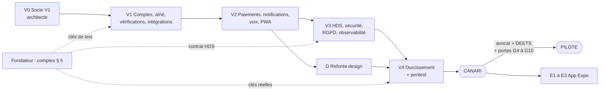
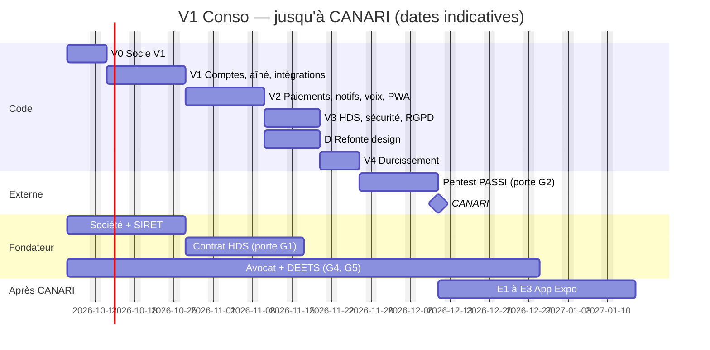
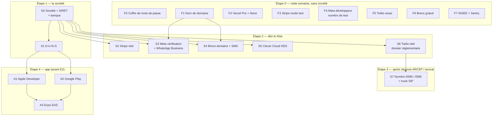

# Plan de construction de la V1 « Conso »

> **Statut :** proposition de l'architecte, 2026-10-05. À valider par le fondateur (orchestrateur).
> **Spécification :** [`specification-v1-conso.md`](specification-v1-conso.md). **Décisions :** ADR [0004](adr/0004-paiements-abonnement-stripe-heures-hors-plateforme.md), [0005](adr/0005-notifications-et-voix.md), [0006](adr/0006-pwa-puis-expo.md), [0007](adr/0007-hebergement-hds-clever-cloud.md).
> **Design :** le sprint D applique `docs/design/direction-artistique.md` (écrit par un autre agent). Ce plan ne décrit pas le design.
> **Convention :** `[À VÉRIFIER]` = prix ou délai non confirmé. « j-agent » = une journée de travail d'un agent.

---

## 0. En une minute

- **6 sprints** jusqu'à l'état `CANARI` (équipe seulement, données réelles de l'équipe) : **~10 semaines**, ~120 j-agent [À VÉRIFIER].
- **Toutes les intégrations** sont derrière des **adaptateurs simulés par défaut**. L'équipe n'attend **aucune** clé pour coder.
- Le **chemin critique** n'est pas le code. C'est : **société → contrat HDS → pentest → `CANARI`**, puis **avocat + DEETS → `PILOTE`**.
- **Action n° 1 du fondateur cette semaine** : créer la société (SIRET) et demander le devis HDS. Sans société, pas de Stripe réel, pas de vérification Meta, pas de D-U-N-S, pas de contrat HDS.
- Les sprints Expo (app iOS et Android) viennent **après** `CANARI` (ADR 0006).

---

## 1. Règles de travail en parallèle

Elles reprennent `lots.md` (MVP) et les adaptent.

1. **Le socle est gelé après V0.** Socle = `prisma/schema.prisma`, `src/server/ports/**`, `src/server/adapters/router.ts`, `src/server/adapters/simule/**`, `src/server/config-check.ts`, `src/server/env.ts`, `src/server/lancement/**`, `src/server/jobs/**` (sauf `handlers/`), `src/server/crypto/**`, `src/server/outbox.ts`, `src/server/api-contracts/**`, `src/middleware.ts`, `next.config.ts`, `package.json`. Seul l'architecte le modifie.
2. **Un fichier = un propriétaire par sprint.** Le tableau de chaque sprint donne les dossiers. Un agent qui a besoin d'un autre fichier le demande à l'orchestrateur.
3. **Les contrats d'abord.** V0 écrit les interfaces (ports, schémas Zod de l'API, signatures des fonctions appelées par les webhooks). Les lots codent ensuite contre ces contrats, en même temps.
4. **Adaptateur simulé par défaut.** Chaque test (unitaire, e2e) tourne avec `ADAPTER_* = simule`. Un adaptateur réel a un **test de contrat** séparé, lancé à la main avec des clés de test.
5. **Aucune nouvelle dépendance** sans accord de l'architecte. Les dépendances V1 sont ajoutées en V0 (§ 3).
6. **Avant de livrer** : `pnpm lint && pnpm typecheck && pnpm test && pnpm build`, puis revue (`reviseur-code`, et `reviseur-securite-rgpd` pour tout ce qui touche aux données, aux webhooks ou à l'authentification).
7. **Données fictives** seulement, dans le code, les tests et les captures.

---

## 2. Calendrier

Dates indicatives. Le pentest et la réponse de la DEETS dépendent de tiers [À VÉRIFIER].

---

## 3. Les sprints

### V0 — Socle V1 (architecte seul, séquentiel)

**Durée :** 5 jours. **Effort :** ~6 j-agent. **Bloque :** tous les autres sprints.

| Livrable | Fichiers |
|---|---|
| Migration Prisma **complète** de la V1 (spec § 17), y compris le schéma `sante` | `prisma/schema.prisma`, `prisma/migrations/**` |
| Ports (interfaces) et adaptateurs **simulés** pour chaque port | `src/server/ports/**`, `src/server/adapters/simule/**` |
| Routeur d'envoi (simulé / réel / bloqué selon l'interrupteur) | `src/server/adapters/router.ts` |
| `KOUDMEN_ENV`, `HOSTING_PROVIDER`, verrous de démarrage | `src/server/config-check.ts`, `src/server/env.ts`, `.env.example` |
| Interrupteur de lancement : `getLaunchState()`, portes, plafond | `src/server/lancement/**` |
| File de tâches : `JobQueuePort`, worker pg-boss, route `cron-tick` | `src/server/jobs/**`, `scripts/worker.ts`, `src/app/api/cron/worker-tick/**` |
| Chiffrement des champs (AES-256-GCM, clés versionnées) | `src/server/crypto/**` |
| Outbox V2 (`dedupeKey`, statuts, tentatives) | `src/server/outbox.ts` |
| Contrats Zod de l'API `/api/v1` + signatures des fonctions de webhooks | `src/server/api-contracts/**` |
| Build `standalone` + script `worker` | `next.config.ts`, `package.json` |
| Dépendances V1 : `stripe`, `pg-boss`, `@serwist/next`, `web-push`, `otpauth`, `@sentry/nextjs`, `twilio` [À VÉRIFIER liste finale] | `package.json`, `pnpm-lock.yaml` |
| Nouvelle table des lots V1 | `docs/tech/lots.md` |

Critère de fin : CI verte ; `demo` toujours fonctionnelle sur Vercel ; chaque port répond en simulé.

### V1 — Comptes, aîné, vérifications, intégrations (4 lots en parallèle)

**Durée :** 10 jours. **Effort :** ~36 j-agent.

| Lot | Agent | Possède | Contenu | Clés nécessaires |
|---|---|---|---|---|
| **K — Comptes** | `dev-backend` | `src/server/auth/**`, `src/app/(public)/{inscription,connexion,mot-de-passe,verification}/**`, `src/app/(compte)/**` (nouveau), `src/components/compte/**` | Inscription réelle, e-mail vérifié, OTP SMS, mot de passe oublié, TOTP opérateur, alerte de connexion, choix des canaux + opt-in, « Mes données » (export, suppression J+30) | Aucune (simulé) |
| **A — Famille et aîné** | `dev-frontend` | `src/app/(famille)/**` (sauf `formule`), `src/server/famille/**`, `src/server/consentement/**` (nouveau), `src/components/famille/**`, `src/app/invitation/**` | Profil aîné V1, situation juridique, demande de consentement, suivi, `kayeAccess`, justificatif (stockage chiffré, purge J+30) | Aucune |
| **B — Accompagnant et vérifications** | `dev-backend` (2e instance) | `src/app/(accompagnant)/**`, `src/server/accompagnant/**`, `src/server/verifications/**` (nouveau), `src/server/sante/kaye/**` (nouveau), `src/components/accompagnant/**` | Kayé chiffré dans le schéma `sante`, réservation de la visio, vérifications par statut (spec § 6.2), relances J-30 / J-7, formation + QCM configurable par statut, limites d'activité | INSEE (facultatif) |
| **I — Intégrations** | `dev-integrations` | `src/server/adapters/{stripe,meta-whatsapp,brevo,twilio,web-push,insee-sirene,s3}/**`, `src/app/api/webhooks/**`, `tests/contrat/**` | Adaptateurs réels + webhooks signés + tests de contrat en mode test. Les webhooks appellent **seulement** les fonctions déclarées en V0 | Comptes de test (§ 5, étape 0) |

Écrans opérateur de V1 (vérifications en visio, appels de bienvenue, interrupteur) : **lot O**, au sprint V2, pour garder 4 lots.

### V2 — Paiements, notifications, voix, PWA, opérateur (5 lots en parallèle)

**Durée :** 10 jours. **Effort :** ~42 j-agent. **Dépend de :** V1 (comptes, consentement, adaptateurs).

| Lot | Agent | Possède | Contenu |
|---|---|---|---|
| **F — Formules et relevés** | `dev-frontend` | `src/app/(famille)/famille/{formule,releves}/**`, `src/server/facturation/**`, `src/server/releves/**`, `src/lib/plans.ts` | Checkout, portail client, résiliation en 3 clics, rétractation, droits par formule, relevé d'heures mensuel (PDF + CSV), mention « Koudmen ne déclare pas à votre place » |
| **N — Notifications** | `dev-backend` | `src/server/notifications/**`, `src/server/notification-templates.ts` | Choix du canal par intention, repli, heures calmes par fuseau, modèles (spec § 8.4), GSM-7, liste des modèles WhatsApp à soumettre à Meta |
| **VX — Voix et incidents** | `dev-backend` (2e instance) | `src/server/voix/**`, `src/server/sante/incidents/**`, `src/server/jobs/handlers/**`, `voix/v1/**` (textes) | Parcours IVR (confirmation, Kozé, consentement, entrant), essais, AMD, touches 1/2/3, incidents P1-P4, SOS |
| **P — PWA et API v1** | `dev-frontend` (2e instance) | `src/app/manifest.ts`, `src/app/sw.ts`, `src/lib/offline/**`, `src/app/api/v1/**`, `public/icons/**` (provisoires) | Manifeste, service worker (Serwist), push web, file hors ligne, scanner QR, invite d'installation, routes `/api/v1` |
| **O — Opérateur** | `dev-integrations` | `src/app/(operateur)/**`, `src/server/operateur/**`, `src/components/operateur/**` | Interrupteur et portes (4 yeux), liste blanche, codes d'invitation `PILOTE`, vérifications en visio, appels de bienvenue, incidents, remboursement, bris de glace |

Point de contact entre lots : VX écrit les gestionnaires de tâches ; N et F les **déclenchent** par `JobQueuePort.enqueue()` (contrat V0). Aucun lot n'édite le fichier d'un autre.

### V3 — Hébergement HDS, sécurité, RGPD, observabilité

**Durée :** 8 jours, **en parallèle** du sprint D. **Effort :** ~16 j-agent. **Dépend de :** V2 ; compte Clever Cloud (§ 5, S5) pour la partie HDS.

| Lot | Agent | Possède | Contenu |
|---|---|---|---|
| **H — Hébergement** | `architecte` + `dev-integrations` | `clevercloud/**`, `scripts/**`, `.github/workflows/**`, `next.config.ts` | Staging HDS sur Clever Cloud, worker permanent, migrations avec verrou, sauvegardes, domaines, sonde `/api/sante` |
| **S — Sécurité** | `architecte` | `prisma/migrations/**` (RLS), `src/middleware.ts` (CSP à nonce), `src/server/crypto/**` | RLS par cercle et par rôle, CSP sans `unsafe-inline`, rotation des clés, gitleaks + Semgrep en CI |
| **R — RGPD et observabilité** | `dev-backend` | `src/server/rgpd/**` (nouveau), `src/server/jobs/handlers/purge-*.ts`, `sentry.*.config.ts`, `src/server/metrics/**` | Purges (spec § 15.3), registre exportable, Sentry UE avec filtre, métriques métier et alertes |

Si le compte Clever Cloud n'existe pas encore : le lot H prépare tout et teste le worker permanent en local (Docker Compose). La bascule se fait dès l'ouverture du compte.

### D — Refonte design

**Durée :** 8 jours, **en parallèle** de V3. **Effort :** ~14 j-agent. **Dépend de :** V2 (tous les écrans V1 existent) ; `docs/design/direction-artistique.md` validé par le fondateur.

| Agent | Possède | Contenu |
|---|---|---|
| `dev-frontend` (2 instances) | `src/app/globals.css`, `src/components/ui/**`, `src/components/layout/**`, `src/components/{famille,accompagnant,operateur,compte,sandbox,legal,feedback}/**`, `src/app/**/page.tsx` et `layout.tsx` (**présentation seulement**), `public/icons/**`, `src/server/notifications/templates/email/**` | Appliquer `docs/design/direction-artistique.md` : jetons, composants de base, écrans, icônes PWA, gabarit d'e-mail |
| `reviseur-accessibilite-ux` | (revue) | Contrastes, tailles de cible, lecteur d'écran, grands caractères |

Règles du sprint D :
1. **Gel des écrans** : pendant D, aucun autre lot ne modifie `src/app/**/page.tsx`, `layout.tsx` ni `src/components/**`. V3 ne touche que le serveur et l'infrastructure : **pas de conflit**.
2. D ne change **ni** une Server Action, **ni** une requête, **ni** un texte réglementaire (mentions de prix, « Koudmen ne déclare pas à votre place »). Un changement de texte passe par l'orchestrateur.
3. Les tests e2e utilisent des sélecteurs par rôle et par texte (pas par classe CSS). Ils doivent rester verts sans changement.

### V4 — Durcissement et préparation de `CANARI`

**Durée :** 5 jours + pentest (10 jours, externe). **Effort :** ~10 j-agent.

| Agent | Contenu |
|---|---|
| `ingenieur-qualite` | e2e complets sur staging HDS ; test de charge des webhooks et de la file ; test de restauration (porte G3) |
| `reviseur-securite-rgpd` | Revue finale ; préparation du pentest (porte G2) ; vérification des DPA |
| `architecte` | `production` en `FERME` ; clés réelles saisies ; runbook d'astreinte ; procédure de violation de données |
| `critique-juridique` | Relecture des écrans de prix (porte G9), des messages et des CGU pour l'avocat |

Critère de fin : portes G1, G2, G3 cochées par 2 opérateurs → `CANARI`.

### Après `CANARI`

| Étape | Contenu | Condition |
|---|---|---|
| Tests réels `CANARI` | Messages et appels réels vers l'équipe ; remise SMS vers 0696 / 0690 ; appel « tapez 1 » sur un fixe 0596 ; paiement réel puis remboursement | Liste blanche |
| `PILOTE` | Familles invitées | Portes G4 à G10 ; plafond `LAUNCH_MAX_STATE` levé par le fondateur |
| **E1** Monorepo | `apps/web`, `apps/mobile`, `packages/domain`, `packages/api-client` (architecte, **gel total** du dépôt 3 jours) | Après `CANARI` |
| **E2** App accompagnant Expo | Visites, check-in hors ligne (SQLite chiffré), QR, SOS, push Expo (~15 j-agent) | Comptes Apple et Google prêts (§ 5, A1 et A2) |
| **E3** Stores | TestFlight, test fermé Google Play, puis publication | Revue Apple et Google [À VÉRIFIER délai] |

---

## 4. Résumé de l'effort

| Sprint | Durée | Lots en parallèle | Effort [À VÉRIFIER] |
|---|---|---|---|
| V0 | 5 j | 1 | 6 j-agent |
| V1 | 10 j | 4 | 36 j-agent |
| V2 | 10 j | 5 | 42 j-agent |
| V3 + D | 8 j | 3 + 1 | 30 j-agent |
| V4 | 5 j (+ 10 j de pentest) | 4 | 10 j-agent |
| **Total jusqu'à `CANARI`** | **~10 semaines** | | **~124 j-agent** |
| E1 à E3 (Expo) | ~5 semaines | 2 | ~25 j-agent |

---

## 5. Comptes et clés que le fondateur doit créer

### 5.1 Règles pour les clés

1. **Ne colle jamais une clé** dans une conversation, un e-mail ou le dépôt GitHub.
2. Saisis chaque clé **toi-même** dans les variables de l'hébergeur (Vercel, puis Clever Cloud), ou dans le coffre de l'équipe (F0).
3. Les clés **réelles** de production : seulement le fondateur et l'architecte y ont accès.
4. Active la **double authentification** (2FA) sur **chaque** compte ci-dessous.
5. Crée chaque compte avec une adresse de l'entreprise (ex. `tech@koudmen.fr`), pas une adresse personnelle.

### 5.2 L'ordre

### 5.3 La liste précise

Coûts et délais : ordres de grandeur, **tous [À VÉRIFIER]** au moment de la création.

#### Étape 0 — cette semaine (aucune société nécessaire)

| # | Compte | Pour quoi | Prérequis | Coût | Délai | Clés à saisir (variables) | Utile dès |
|---|---|---|---|---|---|---|---|
| F0 | **Coffre de mots de passe d'équipe** (Bitwarden Teams ou 1Password Business) | Partager les clés sans les copier en clair | Aucun | ~4 – 8 $/utilisateur/mois | 10 min | — | Tout de suite |
| F1 | **Nom de domaine** `koudmen.fr` (+ `.com`) chez un registraire français (OVHcloud, Gandi) + boîte `tech@` et `contact@` | E-mails, Meta, Stripe, sous-domaines `demo`, `staging`, `app` | Disponibilité du nom [À VÉRIFIER] | ~10 – 20 €/an + boîte ~1 – 5 €/mois | 1 h | — (DNS) | V0 |
| F2 | **Vercel Pro** + **Neon** (offre payante) | Démo et staging de construction. L'offre gratuite de Vercel interdit l'usage commercial ; le cron à la minute du worker demande Pro | Carte bancaire | Vercel ~20 $/membre/mois ; Neon ~0 – 19 $/mois | 15 min | `DATABASE_URL`, `DIRECT_URL` | V0 |
| F3 | **Stripe** (mode **test**) | Coder et tester l'abonnement | Aucun en mode test | 0 € | 10 min | `STRIPE_SECRET_KEY` (sk_test), `STRIPE_WEBHOOK_SECRET` | V1 (lot I) |
| F4 | **Meta for Developers** : application + produit WhatsApp + **numéro de test** fourni par Meta | Coder WhatsApp. Le numéro de test envoie vers 5 destinataires vérifiés, gratuitement | Un compte Facebook personnel | 0 € | 1 h | `WHATSAPP_ACCESS_TOKEN` (temporaire), `WHATSAPP_PHONE_NUMBER_ID`, `WHATSAPP_APP_SECRET`, `WHATSAPP_VERIFY_TOKEN` | V1 |
| F5 | **Twilio** (compte d'**essai**) | Coder l'IVR. L'essai appelle seulement des numéros vérifiés, avec un message d'essai au début | Un numéro de téléphone | 0 € (crédit d'essai) | 15 min | `TWILIO_ACCOUNT_SID`, `TWILIO_AUTH_TOKEN`, numéro d'essai | V1 |
| F6 | **Brevo** (offre gratuite) | Coder l'e-mail et le SMS | Une adresse e-mail | 0 € (300 e-mails/jour) | 15 min | `BREVO_API_KEY` | V1 |
| F7 | **API Sirene (INSEE)** + **Sentry** (région UE) + sonde de disponibilité (Better Stack ou UptimeRobot) | Contrôle du SIRET de l'AE ; erreurs ; alerte si le site tombe | Aucun | INSEE 0 € ; Sentry 0 – 26 $/mois ; sonde 0 € | 30 min | `INSEE_API_KEY`, `SENTRY_DSN` | V1 / V3 |

#### Étape 1 — la société (à lancer **cette semaine**, chemin critique)

| # | Démarche | Pour quoi | Prérequis | Coût | Délai | Résultat |
|---|---|---|---|---|---|---|
| S0 | **Créer la société** (SAS ou SASU) + compte bancaire professionnel + numéro de TVA | **Tous** les comptes réels. Mentions légales. Contrat HDS | Statuts (avocat, porte G4), capital, siège (Martinique ou Hexagone : spec § 19 Q13) | ~250 – 400 € seul, ~1 000 – 2 000 € avec un juriste | 1 – 4 semaines | Kbis, SIREN/SIRET, IBAN |
| S1 | **Numéro D-U-N-S** (Dun & Bradstreet) | Obligatoire pour les comptes **organisation** Apple et Google | Kbis | 0 € | 1 – 4 semaines | Numéro D-U-N-S |

ATTENTION : sans S0, Koudmen ne peut **ni** encaisser, **ni** faire vérifier WhatsApp, **ni** signer le contrat HDS. Le lancement en `CANARI` glisse d'autant.

#### Étape 2 — dès le Kbis

| # | Compte | Pour quoi | Prérequis | Coût | Délai | Clés à saisir | Utile dès |
|---|---|---|---|---|---|---|---|
| S2 | **Stripe : activation du compte réel** + produits Kozé et Sérénité + portail client + webhook | Vrais paiements de l'abonnement | Kbis, IBAN, pièce d'identité du dirigeant, site avec CGV et mentions légales | 0 € fixe ; ~1,5 % + 0,25 € par paiement carte EEE + Billing ~0,7 % | Minutes à quelques jours | `STRIPE_SECRET_KEY` (sk_live), `STRIPE_WEBHOOK_SECRET`, `STRIPE_PRICE_KOZE`, `STRIPE_PRICE_SERENITE` | V4 (production) |
| S3 | **Meta Business : vérification de l'entreprise** + compte WhatsApp Business (WABA) + **numéro dédié** + nom affiché « Koudmen » + utilisateur système (jeton permanent) + moyen de paiement | Vrais messages WhatsApp. Lève la limite d'envoi | Kbis, domaine vérifié (F1), site au même nom ; **un numéro qui n'est pas déjà sur WhatsApp** (SIM dédiée ou ligne fixe) | 0 € fixe ; ~0,05 $ par modèle utilitaire hors fenêtre de 24 h | 2 – 14 jours (vérification) + 1 – 24 h par modèle | `WHATSAPP_ACCESS_TOKEN` (permanent), `WHATSAPP_PHONE_NUMBER_ID`, `WHATSAPP_WABA_ID` | V2 (modèles soumis), V4 |
| S4 | **Brevo : authentification du domaine** (SPF, DKIM, DMARC) + validation du compte + émetteur SMS « Koudmen » + crédits SMS | Vrais e-mails et SMS, bonne délivrabilité | F1, S0 | Starter ~9 – 25 €/mois [À VÉRIFIER] ; SMS ~0,045 – 0,20 € l'unité, achat initial ~50 – 100 € | 1 – 3 jours | `BREVO_API_KEY` (réelle), `BREVO_WEBHOOK_SECRET`, `EMAIL_FROM`, `SMS_SENDER` | V4 |
| S5 | **Clever Cloud** : organisation + **devis HDS** + **contrat avec annexe HDS** + DPA | Staging HDS, puis production. **Porte G1** | Kbis, signataire habilité | ~300 – 1 200 €/mois (staging + production) | **2 – 4 semaines** | `HOSTING_PROVIDER=clever-cloud-hds`, accès à la console pour l'architecte | V3 |
| S6 | **Twilio : passage en compte payant** + **dossier réglementaire France** (documents de la société) + autorisations d'appel vers +596 / +590 (« Voice Geographic Permissions ») + clé d'API | Vrais appels « tapez 1 » ; SMS de secours | Kbis, justificatif d'adresse ; DPA Twilio signé | Recharge initiale ~20 – 50 $ ; ~0,05 – 0,30 $/min vers la Martinique | 1 – 5 jours (dossier) | `TWILIO_API_KEY_SID`, `TWILIO_API_KEY_SECRET`, `TWILIO_AUTH_TOKEN` | V4 |

#### Étape 3 — après la réponse de l'ARCEP, de l'opérateur et de l'avocat

| # | Compte | Pour quoi | Prérequis | Coût | Délai | Clés à saisir |
|---|---|---|---|---|---|---|
| S7 | **Numéro local 0596 (Martinique) et 0590 (Guadeloupe)** + **trunk SIP** relié à Twilio (BYOC), chez un opérateur français ou local | L'aîné reconnaît un numéro local (ADR 0005 § 3.4) | S0 ; réponse sur la tranche ARCEP et le MAN (spec § 19 Q3, Q10) ; S6 | ~10 – 40 €/mois pour 2 numéros | 2 – 6 semaines | `VOICE_FROM_MQ`, `VOICE_FROM_GP`, identifiants du trunk |

Si la réponse est négative : **plan B** (tranche dédiée ou numéro 09 via Twilio). Le code ne change pas, seule la variable change.

#### Étape 4 — l'app iOS et Android (commencer tôt à cause du D-U-N-S)

| # | Compte | Pour quoi | Prérequis | Coût | Délai | Utile dès |
|---|---|---|---|---|---|---|
| A1 | **Apple Developer Program** (compte **organisation**) | TestFlight, App Store, notifications iOS natives | S0, S1 (D-U-N-S), site web, Apple ID avec 2FA | 99 €/an | 1 – 3 semaines | E2 |
| A2 | **Google Play Console** (compte **organisation**) | Test fermé, Play Store | S0, S1 (D-U-N-S), vérification d'identité de l'organisation | 25 $ une fois | Quelques jours à 2 semaines | E2 |
| A3 | **Expo** (EAS Build, EAS Update) | Construire et mettre à jour l'app | A1, A2 | 0 $ au départ ; offre payante si beaucoup de builds | 15 min | E1 |

#### Hors comptes techniques (rappel des portes du lancement)

Ces démarches ne donnent pas de clé, mais elles **bloquent** `CANARI` ou `PILOTE`.

| Démarche | Porte | Coût | Délai |
|---|---|---|---|
| Avocat (montage, CGU, CGV, statuts, D9 formation) | G4 | ~2 000 – 6 000 € | 4 – 8 semaines |
| Courrier à la DEETS (et à la CTM si possible) | G5 | 0 € | 1 – 3 mois |
| DPO externalisé + AIPD + registre | G6 | ~300 – 800 €/mois | 4 – 6 semaines |
| Pentest par un prestataire PASSI | G2 | ~5 000 – 15 000 € | 2 – 4 semaines (réservation comprise) |
| Médiateur de la consommation + assurance RC plateforme | G8 | ~100 – 300 €/an + ~500 – 2 000 €/an | 2 – 4 semaines |
| Voix locales (français, créoles) avec cession de droits | — (V2 voix) | ~300 – 1 500 € | 2 semaines |

### 5.4 Ce qui marche sans aucune clé

Chaque adaptateur est **simulé par défaut** (spec § 18.1). Le tableau montre quand chaque intégration passe au réel.

| Intégration | Adaptateur par défaut | Passe en mode test avec | Passe en réel avec | Environnement réel |
|---|---|---|---|---|
| Abonnement | `simule` | F3 | S2 | `production` dès `CANARI` |
| WhatsApp | `simule` | F4 | S3 | `production` |
| E-mail | `simule` (aperçu opérateur) | F6 | S4 | `staging`, `production` |
| SMS | `simule` | F6 ou F5 | S4 (+ S6 en secours) | `production` |
| Voix (IVR) | `simule` (bouton « simuler la touche » en `demo` et `staging`) | F5 | S6 + S7 | `production` |
| Push web | `simule` | Clés VAPID générées par l'équipe | Idem | `staging`, `production` |
| SIRET (AE) | `simule` | F7 | F7 | `staging`, `production` |
| Stockage objet | `local` | S5 | S5 | `staging` HDS, `production` |
| Hébergement | Vercel + Neon (F2) | — | S5 | `production` |

DANGER : une clé réelle saisie en `staging` peut envoyer un vrai SMS ou un vrai appel à un numéro fictif qui existe. En `staging`, utilise **seulement** les clés de test et les numéros de l'équipe.

---

## 6. Risques du plan

| Risque | Effet | Parade |
|---|---|---|
| Société créée en retard | Tout le réel glisse | Lancer S0 cette semaine ; coder en simulé en attendant |
| Contrat HDS long | `CANARI` glisse | Devis dès le Kbis ; Scaleway en alternative |
| Numéro 0596 refusé (ARCEP, MAN) | Moins de confiance de l'aîné | Plan B prêt ; carte « Koudmen vous appelle depuis le … » |
| Modèles WhatsApp refusés par Meta | Repli sur SMS (plus cher) | Modèles utilitaires sobres, soumis dès V2 |
| Remise SMS faible vers 0696 / 0690 | Alertes perdues | Test réel en `CANARI` ; Twilio ou opérateur local en secours |
| Réponse de la DEETS lente | `PILOTE` glisse | `CANARI` long avec l'équipe ; aucune vraie famille avant G4 et G5 |
| Conflits de fichiers entre agents | Retards, régressions | Socle gelé, un propriétaire par dossier, gel des écrans pendant D |
