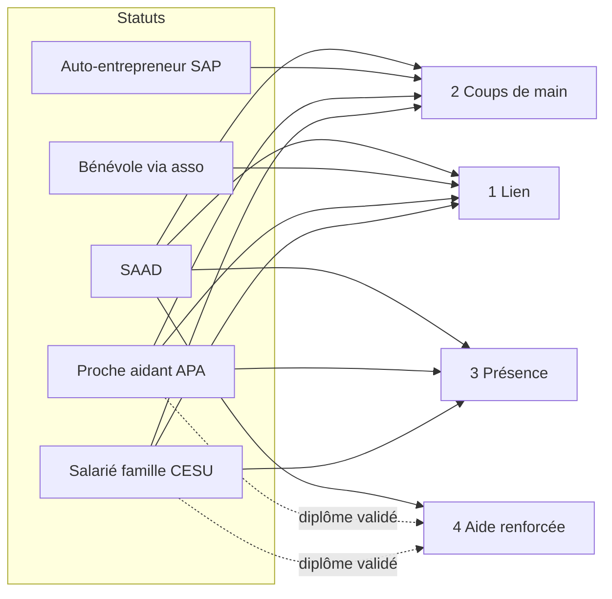
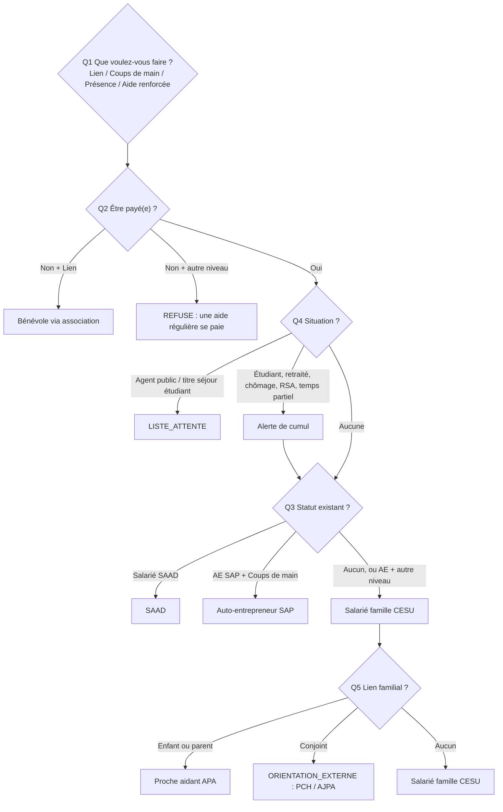
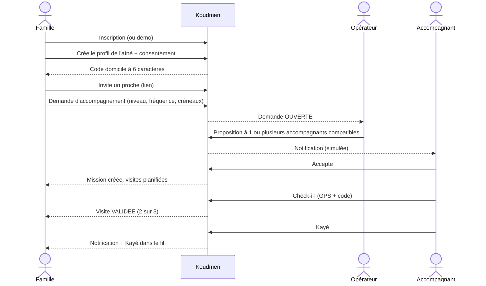
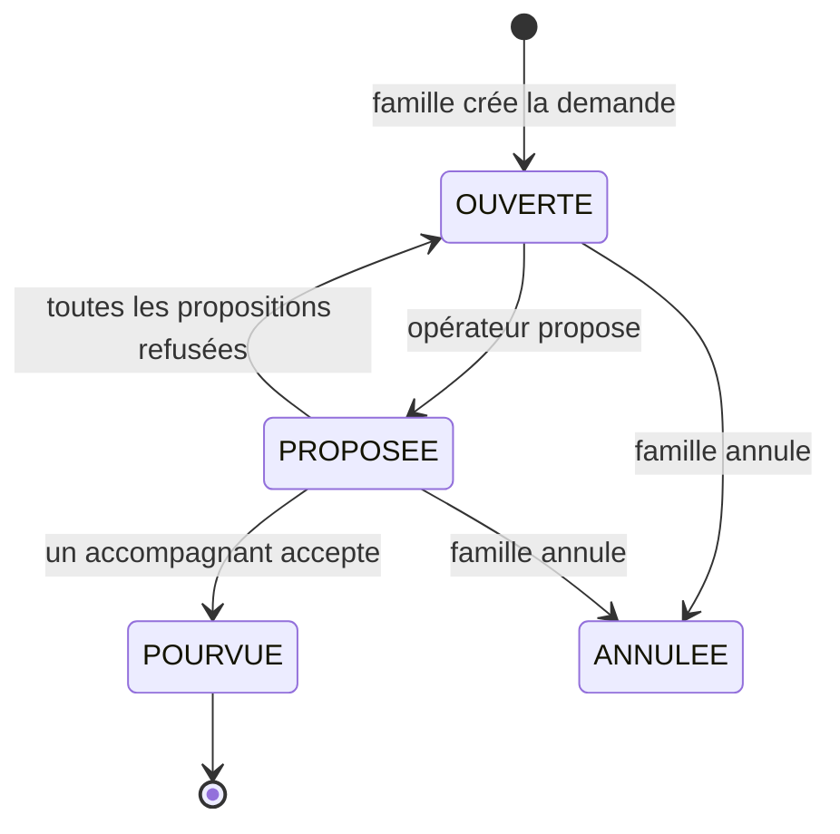
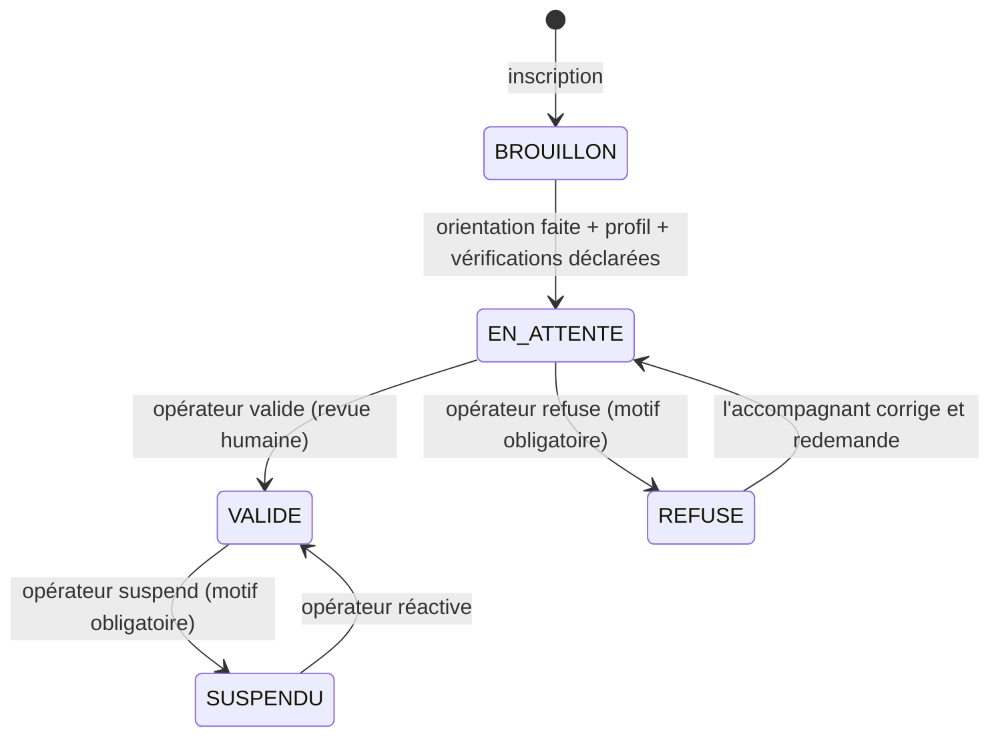
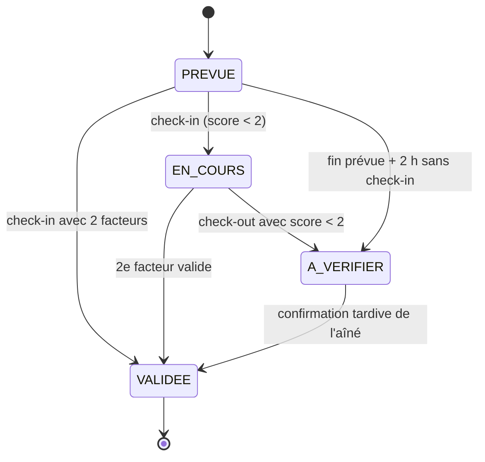
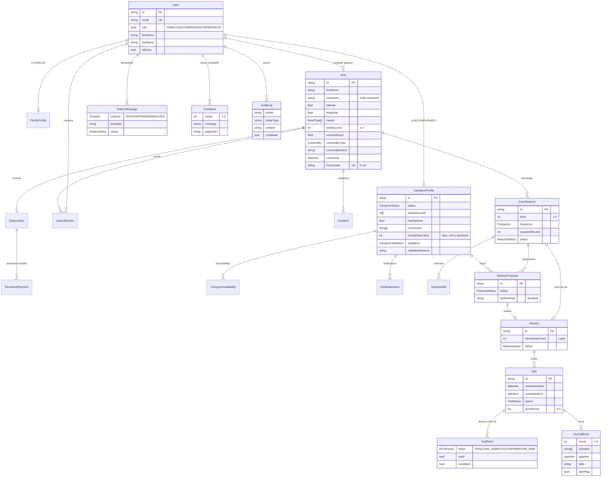
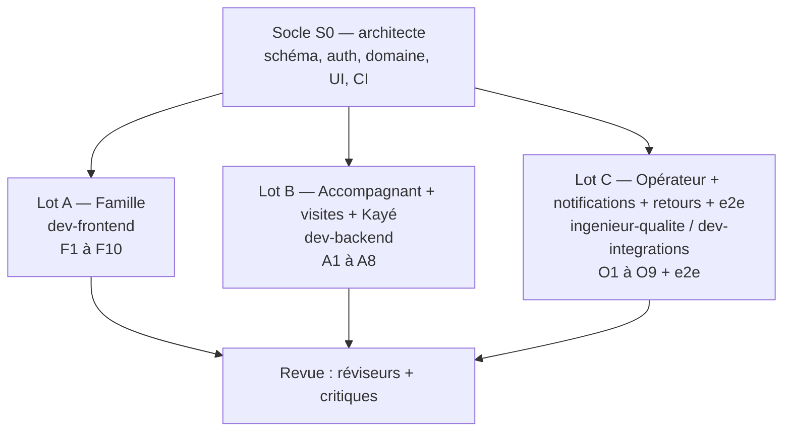

# Spécification MVP Koudmen — version de test web

> **Statut :** S0, à faire critiquer (critique-produit, critique-juridique) avant le sprint de construction.
> **Décisions liées :** [ADR 0001](adr/0001-mvp-nextjs-fullstack.md) (Next.js full-stack), [ADR 0002](adr/0002-auth-session-cookie.md) (session).
> **Code :** `plateforme/`. **Lots :** [`lots.md`](lots.md).

## 0. En une minute

- Koudmen MVP est **une application web** pour des **testeurs réels**.
- Les testeurs utilisent **uniquement des données fictives**. Aucun paiement réel. Aucun message réel.
- Quatre rôles : **Famille**, **Aîné** (profil, sans compte), **Accompagnant**, **Opérateur**.
- Le cœur : une famille demande un accompagnement → l'opérateur propose un accompagnant compatible → l'accompagnant accepte librement → chaque visite est **prouvée (2 facteurs sur 3)** → l'accompagnant écrit le **Kayé** → la famille le lit.

```mermaid
flowchart LR
  F[Famille] -->|1. crée le profil + consentement| AI[Aîné]
  F -->|2. demande d'accompagnement| O[Opérateur]
  O -->|3. proposition (matching manuel)| A[Accompagnant]
  A -->|4. accepte ou refuse, sans pénalité| O
  A -->|5. visite + preuve 2 sur 3| AI
  A -->|6. Kayé| F
  O -.->|notifications simulées| F
  O -.->|notifications simulées| A
```

## 1. Principes non négociables

| # | Principe | Effet dans le MVP |
|---|---|---|
| P1 | **Données fictives** | Bandeau sur chaque page. Case obligatoire à l'inscription. Mention sur la page « Mentions et confidentialité ». |
| P2 | **Anti-requalification** (directive (UE) 2024/2831) | Tarif horaire **libre** fixé par l'accompagnant. Refus **sans pénalité** et sans motif obligatoire. **Aucune note** sur l'accompagnant. Pas de géolocalisation continue. Désactivation **motivée** avec **revue humaine**. |
| P3 | **Le statut décide du niveau** (`docs/08`) | `canStatusDoLevel()` bloque toute proposition interdite. Un auto-entrepreneur n'est **jamais** proposé pour un niveau 3 ou 4. |
| P4 | **RGPD by design** | Consentement de l'aîné ou de son représentant (nom + date). Aucun champ de santé détaillé. Accès limité au cercle Lakou. Audit des actions sensibles. |
| P5 | **Retour testeur partout** | Bouton « Donner mon avis » sur toutes les pages. |
| P6 | **Accessibilité** | Cibles ≥ 44 px, focus visible, libellés de champs, contraste AA, thème sombre, mobile d'abord. |

## 2. Les rôles

| Rôle | Compte | Qui | Ce qu'il fait |
|---|---|---|---|
| `FAMILLE` | Oui | Payeur, souvent dans la diaspora | Crée le profil de l'aîné, invite le cercle Lakou, demande un accompagnement, lit les visites et le Kayé, choisit une formule |
| Aîné | **Non** | La personne accompagnée | Profil géré par la famille. Confirme la visite (appel simulé) |
| `ACCOMPAGNANT` | Oui | Particulier ou professionnel avec un statut | Fait l'orientation statut, remplit son profil, déclare ses vérifications, répond aux propositions, fait les visites, écrit le Kayé |
| `OPERATEUR` | Oui (seed seulement) | Équipe Koudmen | Valide les accompagnants, fait le matching manuel, surveille les visites, lit l'Outbox et les retours testeurs |

## 3. Niveaux et statuts

Le MVP numérote les niveaux **de 1 à 4**. Correspondance avec `docs/08` § 3.1 :

| MVP | `docs/08` | Activités | Statuts autorisés |
|---|---|---|---|
| **1 — Lien** | niveau 0 | Appel, visite de courtoisie, promenade, lecture | Salarié famille, proche aidant, bénévole, SAAD |
| **2 — Coups de main** | niveau 1 | Courses, repas, papiers à domicile, numérique | Salarié famille, proche aidant, **auto-entrepreneur SAP**, SAAD |
| **3 — Présence et autonomie** | niveau 2 | Compagnie régulière, aide au repas, rendez-vous, sorties | Salarié famille, proche aidant, SAAD |
| **4 — Aide renforcée** | niveau 3 | Toilette, transferts, nuits | SAAD ; salarié famille ou proche aidant **avec diplôme validé** |

[À VÉRIFIER] avocat : l'auto-entrepreneur est exclu du niveau 1 « Lien », car le lien est de la compagnie (activité réservée au salarié). `docs/08` § 3.1 dit « Tous » pour ce niveau.



Code : `plateforme/src/server/rules/status-levels.ts` → `allowedLevelsFor()`, `canStatusDoLevel()`.

### 3.1 Orientation statut en 5 questions

Code : `plateforme/src/server/rules/orientation.ts` → `orientCaregiver(answers)`.



Résultat : `outcome` (RECOMMANDE / REFUSE / LISTE_ATTENTE / ORIENTATION_EXTERNE), `status`, `allowedLevels`, `warnings`, `requiredVerifications`, `explanation`.

## 4. Parcours principaux

### 4.1 Famille (de l'inscription au Kayé)



### 4.2 Cycle d'une demande



### 4.3 Cycle d'un accompagnant



## 5. Écrans

Chaque écran existe déjà en **squelette** (`PagePlaceholder`). Le lot propriétaire le remplace.

### 5.1 Écrans publics (socle — FAITS en S0)

| Route | Contenu |
|---|---|
| `/` | Présentation, étapes, formules, boutons démo « Essayer en tant que Famille / Accompagnant / Opérateur » |
| `/connexion` | Email + mot de passe ; boutons démo |
| `/inscription` | Choix Famille / Accompagnant ; prénom, nom, email, mot de passe ; lieu de vie (famille) ; case « données fictives » obligatoire. Accompagnant → redirection `/accompagnant/orientation` |
| `/mentions` | Mentions et confidentialité (version simple) |

### 5.2 Espace Famille (Lot A)

| Id | Route | Contenu et règles |
|---|---|---|
| F1 | `/famille` | Liste des aînés du cercle (carte : prénom, commune, niveau, formule, prochaine visite, dernier Kayé). Bouton « Ajouter un aîné ». État vide guidé. |
| F2 | `/famille/aines/nouveau` | Prénom, initiale du nom, commune (liste des 34 communes), indication d'adresse (facultatif), téléphone de l'aîné (fictif), besoins (cases), niveau d'activité 1-4 (avec description), **consentement** : case + type (AINE / REPRESENTANT) + nom de la personne qui consent. Crée : `Aine` (position = centre de la commune, `homeCode` via `generateUniqueHomeCode()`), `LakouMember` (payeur), `Subscription` LAKOU. Audit `aine.created`. |
| F3 | `/famille/aines/[aineId]` | Fiche : infos, **code domicile en grand** (à afficher chez l'aîné), consentement, formule, liens vers cercle / demandes / visites. Modifier le profil. |
| F4 | `/famille/aines/[aineId]/cercle` | Membres du cercle. Formulaire d'invitation (lien, email facultatif, relation). Lien copiable `/invitation/[token]`, valable 14 jours. Outbox `INVITATION_LAKOU` si email. Audit `lakou.invited`. |
| F5 | `/famille/demandes` | Demandes par aîné, statut (`RequestStatusBadge`), propositions en cours (sans détail du refus d'un accompagnant). Bouton « Annuler ». |
| F6 | `/famille/demandes/nouvelle` | Aîné, niveau (1-4, pré-rempli par le niveau d'activité), fréquence, créneaux (jour × matin / après-midi / soir), durée, date de début, notes. Rappel : « pas d'information médicale ». |
| F7 | `/famille/visites` | Visites à venir et passées : date, accompagnant, statut, facteurs de preuve (icône par facteur, libellé texte). Sur une visite EN_COURS ou A_VERIFIER : bouton **« L'aîné a confirmé (appel simulé) »** → `confirmElderSimulated()`. |
| F8 | `/famille/kaye` | Fil chronologique des Kayé de tous les aînés du cercle : humeur (1-5, texte + pictogramme), activités, appétit, note, signal « à surveiller » mis en avant. Filtre par aîné. |
| F9 | `/famille/formule` | 3 formules (`PLANS`). Choix → `Subscription` mise à jour + `SimulatedPayment` (SIMULE_REUSSI) + Outbox `PAIEMENT_SIMULE` + audit `plan.changed`. Mention « Aucun paiement réel ». Seul le payeur change la formule. |
| F10 | `/invitation/[token]` | Page publique. Jeton valide → « Rejoindre le cercle de X ». Pas connecté → connexion / inscription puis retour. Crée `LakouMember`. Jeton expiré ou utilisé → message clair. |

### 5.3 Espace Accompagnant (Lot B)

| Id | Route | Contenu et règles |
|---|---|---|
| A1 | `/accompagnant` | État du profil (badge validation), checklist à compléter, propositions en attente, prochaines visites. Si `status` null → bouton vers l'orientation. |
| A2 | `/accompagnant/orientation` | 5 questions (une par étape, mobile d'abord). Résultat via `orientCaregiver()`. Enregistre `status`, `orientationAnswers`, `allowedLevels` (recalculés serveur), crée les `VerificationItem` requis (A_FOURNIR). Refaisable tant que le profil n'est pas VALIDE. |
| A3 | `/accompagnant/profil` | Communes (multi-choix), disponibilités (grille 7 × 3), **tarif horaire libre** (champ libre en euros ; masqué si bénévole ; rappel du SMIC pour le salarié [À VÉRIFIER montant]), bio, association / SAAD / SIRET selon statut. |
| A4 | `/accompagnant/verifications` | Une ligne par `VerificationItem` : statut, déclaration (texte), bouton « J'ai fourni ». **Aucun fichier stocké** dans le MVP. Quand tout est DECLARE + profil complet → bouton « Demander la vérification » → `validation = EN_ATTENTE`. |
| A5 | `/accompagnant/propositions` | Propositions EN_ATTENTE : aîné (prénom + commune), niveau, fréquence, créneaux, notes, tarif (le sien). Boutons **Accepter** / **Refuser** ; note de refus **facultative**. Accepter : `Mission` (copie du tarif), visites des 4 prochaines semaines, autres propositions de la demande → ANNULEE, demande → POURVUE, notifications. Refuser : aucun effet sur le profil. |
| A6 | `/accompagnant/visites` | Visites à venir / passées, statut, Kayé à écrire. |
| A7 | `/accompagnant/visites/[visiteId]` | **Check-in** : demande de position UNE fois (`navigator.geolocation.getCurrentPosition`, avec explication avant) → `evaluateGps()` ; saisie du **code domicile** → `verifyHomeCode()`. Chaque facteur → `recordProof()`. En mode test, bouton « Simuler ma position au domicile » (facteur GPS `simulated: true`). **Check-out**. Affiche le score 0-3. |
| A8 | `/accompagnant/visites/[visiteId]/kaye` | Humeur 1-5, activités (suggestions + libre), appétit, note libre, case « à surveiller » + précision. Rappel : « pas de diagnostic, pas de médicament ». Un Kayé par visite. Outbox `KAYE_PUBLIE` au cercle ; `ALERTE_A_SURVEILLER` si signal. |

### 5.4 Espace Opérateur (Lot C)

| Id | Route | Contenu et règles |
|---|---|---|
| O1 | `/operateur` | Compteurs : accompagnants EN_ATTENTE, demandes OUVERTE, visites A_VERIFIER, retours testeurs NOUVEAU. Liens rapides. |
| O2 | `/operateur/accompagnants` | Liste filtrable par validation et statut. |
| O3 | `/operateur/accompagnants/[caregiverId]` | Profil, orientation, vérifications (valider / refuser chaque item avec note). Décision : **Valider**, **Refuser** ou **Suspendre** — **motif obligatoire** pour refuser / suspendre. Le niveau 4 s'ouvre si `DIPLOME` validé (`hasDiploma` + `allowedLevelsFor`). Outbox `ACCOMPAGNANT_VALIDE` / `ACCOMPAGNANT_REFUSE`. Audit. |
| O4 | `/operateur/demandes` | Demandes OUVERTE et PROPOSEE, ancienneté. |
| O5 | `/operateur/demandes/[requestId]` | **Matching manuel** : liste de tous les accompagnants avec `checkCompatibility()` → compatibles d'abord, raisons d'incompatibilité affichées (`MATCH_REASON_LABELS`). Tri **sans note ni score de réputation** (critère : créneaux communs, puis nom). Bouton « Proposer » (message facultatif). **Le serveur refuse** une proposition incompatible. Outbox `PROPOSITION_MISSION`. |
| O6 | `/operateur/visites` | Toutes les visites, filtre par statut. Détail des facteurs. Bouton « L'aîné a confirmé (appel simulé) ». |
| O7 | `/operateur/notifications` | Boîte d'envoi : date, canal, destinataire, modèle, sujet, corps. Filtre par canal. |
| O8 | `/operateur/retours` | Retours testeurs : note, message, page, rôle, date. Statut NOUVEAU → LU → TRAITE. |
| O9 | `/operateur/journal-audit` | Journal d'audit (lecture seule), filtre par action / entité. |

### 5.5 Transverse (socle — FAIT)

- **Bouton « Donner mon avis »** (root layout) : note 1-5 + message + page courante → `Feedback`. Fonctionne connecté ou non.
- **Bandeau de test** si `NEXT_PUBLIC_TEST_MODE=true`.
- **Pied de page** avec lien « Mentions et confidentialité ».

## 6. Règles métier

| Id | Règle | Où |
|---|---|---|
| RM-01 | Un accompagnant n'est proposé que si `validation = VALIDE`, statut défini, niveau autorisé, commune desservie, au moins un créneau commun (si la demande a des créneaux) | `checkCompatibility()` (Lot C) |
| RM-02 | Un auto-entrepreneur n'est jamais proposé pour un niveau 3 ou 4 | `canStatusDoLevel()` |
| RM-03 | `allowedLevels` est toujours **recalculé côté serveur** par `allowedLevelsFor()`. Jamais lu depuis le formulaire | Lots B et C |
| RM-04 | Le tarif horaire est fixé **par l'accompagnant seul**. L'opérateur et la famille ne le modifient pas | Lot B |
| RM-05 | Refuser une proposition n'a **aucune conséquence** : pas de compteur, pas de baisse de visibilité | Lots B et C |
| RM-06 | Aucune note, étoile ou classement des accompagnants | Tous |
| RM-07 | Refus ou suspension d'un accompagnant : **motif obligatoire**, décision par un opérateur humain, audit | Lot C |
| RM-08 | GPS : **une seule** position, au check-in, après accord explicite. Pas de suivi, pas de position au check-out | Lot B |
| RM-09 | Visite VALIDEE dès **2 facteurs valides sur 3** ; A_VERIFIER après check-out (ou 2 h après la fin prévue) avec moins de 2 | `deriveVisitStatus()` |
| RM-10 | La confirmation de l'aîné est **simulée** et marquée `simulated = true`, avec message VOIX dans l'Outbox | `confirmElderSimulated()` |
| RM-11 | Une famille voit seulement les aînés de son cercle Lakou. Un accompagnant voit seulement les aînés de ses missions | `canAccessAine()` |
| RM-12 | Le profil d'un aîné exige un consentement (case + nom + type) | Lot A |
| RM-13 | Aucun champ de santé détaillé. Le Kayé est non médical. Le signal « à surveiller » n'est pas une alerte médicale | Lots A et B |
| RM-14 | Seul le payeur change la formule. Paiement toujours simulé | Lot A |
| RM-15 | Actions sensibles journalisées par `logAudit()` (liste § 9) | Tous |
| RM-16 | Toute Server Action commence par `requireRole()` puis le contrôle d'accès à la ressource, puis la validation Zod | Tous |

## 7. Preuve de visite « 2 sur 3 »

| Facteur | MVP | Valide si |
|---|---|---|
| (a) GPS | `getCurrentPosition` une fois au check-in | distance au domicile ≤ 300 m et précision ≤ 500 m (`evaluateGps`) [À VÉRIFIER rayon terrain] |
| (b) Code domicile | 6 caractères sur la fiche aîné, saisis par l'accompagnant | `verifyHomeCode` (insensible à la casse et aux espaces) |
| (c) Confirmation aîné | Bouton « L'aîné a confirmé (appel simulé) » côté famille ou opérateur | toujours valide, `simulated = true` |



Code : `src/server/visits/proof.ts` (pur) et `src/server/visits/service.ts` (`recordProof`, `refreshVisitStatus`, `confirmElderSimulated`).

## 8. Notifications (Outbox simulée)

Rien ne part. Chaque message est créé avec le statut `ENVOYE_SIMULE`. Canal par défaut : WhatsApp si le destinataire a un téléphone, sinon email (`notifyUser`).

| Événement | Modèle | Destinataire | Lot |
|---|---|---|---|
| Invitation Lakou | `INVITATION_LAKOU` | email invité | A |
| Formule choisie | `PAIEMENT_SIMULE` | payeur | A |
| Proposition | `PROPOSITION_MISSION` | accompagnant | C |
| Acceptation / refus | `PROPOSITION_ACCEPTEE` / `PROPOSITION_REFUSEE` | cercle Lakou | B |
| Validation / refus profil | `ACCOMPAGNANT_VALIDE` / `ACCOMPAGNANT_REFUSE` | accompagnant | C |
| Check-in | `VISITE_COMMENCEE` | cercle Lakou | B |
| Visite validée / à vérifier | `VISITE_VALIDEE` / `VISITE_A_VERIFIER` | cercle Lakou | socle (auto) |
| Appel aîné | `APPEL_CONFIRMATION_AINE` (VOIX) | aîné | socle (auto) |
| Kayé | `KAYE_PUBLIE` ; `ALERTE_A_SURVEILLER` | cercle Lakou | B |

Règle `docs/05` § 3.2 : **aucune donnée de santé dans un message**. Le message renvoie vers l'espace connecté.

## 9. Modèle de données

Source de vérité : `plateforme/prisma/schema.prisma` (complet en S0, migration `init`).



### 9.1 Actions à auditer (`logAudit`)

`auth.register`, `auth.login`, `auth.demo_login`, `auth.logout` (socle) · `aine.created`, `aine.updated`, `aine.consent`, `lakou.invited`, `lakou.joined`, `request.created`, `request.cancelled`, `plan.changed`, `visit.proof.recorded` (Lot A / socle) · `caregiver.orientation`, `caregiver.profile.updated`, `caregiver.submitted`, `proposal.accepted`, `proposal.declined`, `visit.checkin`, `visit.checkout`, `journal.created` (Lot B) · `caregiver.validate`, `caregiver.refuse`, `caregiver.suspend`, `verification.reviewed`, `proposal.created`, `feedback.status` (Lot C).

Ne mets **jamais** de mot de passe, de code domicile ni de texte de Kayé dans `metadata`.

## 10. RGPD et sécurité (MVP)

| Sujet | Mesure |
|---|---|
| Minimisation | Prénom + initiale de l'aîné. Adresse : indication libre facultative. Position : centre de la commune par défaut |
| Consentement | Case + nom + type + date. Affiché sur la fiche aîné |
| Santé | Aucun champ médical. Besoins = catégories d'aide. Kayé non médical |
| Accès | `requireRole` + `canAccessAine` sur chaque lecture et écriture |
| Session | Cookie httpOnly signé, 7 jours (ADR 0002) |
| En-têtes | `X-Frame-Options: DENY`, `nosniff`, `Referrer-Policy`, `Permissions-Policy: geolocation=(self)` |
| Mode test | Bandeau, case à l'inscription, page Mentions, comptes démo marqués |
| Hébergement | ATTENTION : non HDS. Données fictives seulement (ADR 0001) |

## 11. Découpage en 3 lots

Détail des fichiers possédés, fonctions disponibles et conventions : [`lots.md`](lots.md).



Données de démo : chaque lot peut démarrer sans attendre les autres. Le seed contient des aînés, une mission, des visites, des Kayé, une demande OUVERTE et des propositions EN_ATTENTE.

## 12. Hors périmètre du MVP

- App mobile hors ligne, vraie voix (IVR), vrais WhatsApp / SMS / email.
- Vrais paiements, CESU+, avance immédiate, facturation.
- Stockage de pièces justificatives.
- Veyé Siklòn, ordonnance sociale, multi-territoire.
- Partage des frais entre frères et sœurs, « droit au secret ».

## 13. Questions ouvertes

1. [À VÉRIFIER] Auto-entrepreneur et niveau 1 « Lien » (voir § 3).
2. [À VÉRIFIER] Rayon GPS de 300 m adapté au relief martiniquais ?
3. [À VÉRIFIER] Prix affiché de Sérénité (forfait 149 € ou 19,90 € + frais, `docs/00` § 3).
4. [À VÉRIFIER] Centres des communes (coordonnées approximatives).
5. Faut-il une confirmation de l'aîné par un membre du cercle **présent sur place** plutôt qu'un appel simulé ?
