# Spécification V1 « Conso » de Koudmen

> **Statut :** proposition de l'architecte, 2026-10-05. À valider par le fondateur (orchestrateur).
> **Succède à :** MVP de test ([`specification-mvp.md`](specification-mvp.md), ADR 0001 à 0003, `docs/revues/*`).
> **Décisions liées :** [ADR 0004](adr/0004-paiements-abonnement-stripe-heures-hors-plateforme.md) (paiements), [ADR 0005](adr/0005-notifications-et-voix.md) (notifications et voix), [ADR 0006](adr/0006-pwa-puis-expo.md) (PWA puis Expo), [ADR 0007](adr/0007-hebergement-hds-clever-cloud.md) (hébergement HDS).
> **Plan de travail :** [`plan-v1.md`](plan-v1.md).
> **Design :** hors de ce document. Un autre agent le produit dans `docs/design/`. Ce document laisse des **points d'entrée** (§ 14).
> **Convention :** `[À VÉRIFIER]` = prix, délai ou point juridique non confirmé. Aucun chiffre marqué ainsi ne sert à une décision sans contrôle.

---

## 0. En une minute

- La V1 transforme le MVP de test en **service réel** : vrais comptes, vrais paiements, vrais messages, vrais appels.
- La V1 se construit **maintenant**, en parallèle de la validation juridique.
- La V1 **ne s'ouvre** aux vraies familles qu'après 3 feux verts : **avis de l'avocat**, **réponse de la DEETS**, **hébergement HDS** en place. Un **interrupteur de lancement** le garantit (§ 3).
- Chaque fournisseur externe (Stripe, WhatsApp, SMS, voix, e-mail) passe par un **adaptateur**. L'implémentation **simulée** est active par défaut. L'équipe avance donc **sans clés**.
- Support : **web mobile installable (PWA) d'abord**. App iOS et Android (Expo) **ensuite**.
- Le **mode démo** reste, sur un déploiement séparé, avec des données fictives. Les robots du bac à sable **n'existent plus** en production.

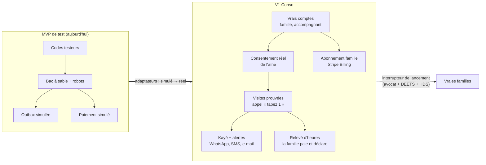

---

## 1. Ce qui ne change pas (règles non négociables)

Ces règles viennent du MVP et des revues. La V1 les garde **telles quelles**.

| # | Règle | Effet en V1 |
|---|---|---|
| R1 | **Koudmen montre, la famille choisit, l'accompagnant accepte** (D6) | Le flux de matching du MVP reste. Aucune affectation automatique |
| R2 | **Tarif libre** fixé par l'accompagnant. Plancher légal pour un salarié (D10) | `PLANCHER_SALARIE_CENTS` reste. Pas de « tarif Koudmen » |
| R3 | **Refus sans pénalité** (RM-05) | Aucun compteur de refus. Aucune baisse de visibilité |
| R4 | **Pas de géolocalisation continue** (RM-08) | Une position au check-in seulement. On stocke « valide oui/non » + distance arrondie (P7) |
| R5 | **Aucune note** sur l'accompagnant (RM-06). Avis jamais sanctionnants | Pas d'étoiles. Pas de classement par performance |
| R6 | **Désactivation motivée, revue humaine, réexamen** (D5, RM-07) | Motif dans une liste fermée. Bouton « Demander un réexamen ». E-mail sur support durable |
| R7 | **0 € prélevé sur l'accompagnant** (`docs/00` § 3, art. L5321-3 C. trav.) | Aucun flux d'argent de l'accompagnant vers Koudmen |
| R8 | **Koudmen ne déclare pas à la place de la famille** (D12, P5) | Relevé d'heures indicatif. La famille déclare sur cesu.urssaf.fr. Koudmen ne détient jamais ses identifiants CESU |
| R9 | **Aucune donnée de santé dans un message** (`docs/05` § 3.2) | WhatsApp, SMS, e-mail et push contiennent un lien, jamais le contenu du Kayé |
| R10 | **Le statut décide du niveau** (`docs/08`, D11) | `canStatusDoLevel()` reste la seule source. L'AE n'est jamais proposé aux niveaux 1, 3, 4 |
| R11 | **L'opérateur ne valide pas les visites** (P6) | La preuve sert la famille. L'opérateur fait du support et de la sécurité |
| R12 | **Monolithe modulaire** | Une application Next.js + un processus « worker ». Pas de micro-service (ADR 0007) |

---

## 2. Périmètre V1

### 2.1 Dans la V1

| Domaine | Contenu | Section |
|---|---|---|
| Environnements | 3 environnements : `demo`, `staging`, `production`. Robots et codes testeurs **seulement** en `demo` | § 3 |
| Interrupteur de lancement | États `FERME` → `CANARI` → `PILOTE` → `OUVERT`, avec portes de conformité | § 3.3 |
| Comptes | Inscription réelle, e-mail vérifié, téléphone vérifié (OTP), mot de passe oublié, 2FA opérateur, « Mes données » | § 4 |
| Aîné | Profil, situation juridique, **consentement réel** (appel humain ou vocal), notice FALC, cercle choisi par l'aîné | § 5 |
| Accompagnant | Inscription, orientation (5 questions), vérifications réelles : identité, B3, 2 références, formation, SIRET/NOVA pour l'AE | § 6 |
| Paiements | Abonnement famille par carte (Stripe Billing). Heures **hors plateforme** (CESU+ ou facture de l'AE) | § 7 |
| Relevé d'heures | Relevé mensuel issu des visites prouvées, validé par la famille | § 7.5 |
| Notifications | WhatsApp Business Cloud API, SMS, e-mail, push web. Repli automatique | § 8 |
| Voix (IVR) | Appel automatique « tapez 1 » après la visite. Messages pré-enregistrés (français et créole). Numéros locaux 0596 / 0590 visés | § 9 |
| Kozé | Appel automatique hebdomadaire « Tout va bien ? » (réutilise l'IVR) | § 9.6 |
| PWA | Installable, push web, hors ligne pour l'accompagnant (visites de 7 jours, check-in en file) | § 10 |
| Incidents | SOS accompagnant, incident ouvert par l'IVR (touche 2 ou 3), niveaux P1 à P4 | § 9.4 |
| Hébergement | Production chez un hébergeur **certifié HDS** (Clever Cloud). Démo reste sur Vercel + Neon | § 12 |
| Sécurité et RGPD | 2FA opérateur, RLS, chiffrement des champs sensibles, AIPD, registre, durées de conservation | § 13, § 15 |
| Observabilité | Erreurs, journaux, métriques métier, alertes d'astreinte | § 16 |

### 2.2 Hors de la V1

| Sujet | Quand | Pourquoi |
|---|---|---|
| App native iOS et Android (Expo) | V2 (plan § 11) | PWA d'abord (décision 5 du fondateur) |
| Paiement des heures par Koudmen (Stripe Connect) | Pas avant un avis écrit de l'avocat | ADR 0004 |
| Avance immédiate via l'API Tiers de prestation URSSAF | V2, après habilitation | Habilitation longue, risque politique (`docs/05` § 4.4) |
| Déclarations CESU par Koudmen (API Tierce déclaration) | Après l'agrément mandataire | D12, P5 |
| Comptes « organisation » (SAAD partenaire, association de bénévoles) | V1.1 | P9, P10. En V1 : orientation vers une liste d'attente |
| Partage des frais entre frères et sœurs | V1.1 | Un seul payeur par aîné en V1 |
| Résumé du Kayé par IA, signaux faibles | V2 | Garde-fous IA, AI Act à valider |
| Veyé Siklòn complet (mode cyclone) | V1.1 | La V1 garde le repli SMS + voix, base du mode cyclone |
| NFC | V2 (Expo) | Web NFC seulement sur Android Chrome |
| Vérification d'identité automatique (PVID : Ubble, IDnow) | V1.1 | V1 : contrôle humain en visio, sans copie |
| Signature électronique (Yousign) | V1.1 | V1 : consentement par appel journalisé |

---

## 3. Environnements, mode démo et interrupteur de lancement

### 3.1 Trois environnements

| Variable `KOUDMEN_ENV` | Où | Données | Robots, codes testeurs | Adaptateurs autorisés |
|---|---|---|---|---|
| `demo` | Vercel + Neon (actuel) | Fictives | **Oui** (bac à sable ADR 0003) | **Simulés seulement** (forcé) |
| `staging` | Clever Cloud HDS (application séparée) | Fictives | Non | Simulés, ou mode test des fournisseurs (Stripe test, numéros de l'équipe) |
| `production` | Clever Cloud HDS | Réelles | **Non** (le code refuse) | Réels. Simulé refusé quand l'interrupteur dépasse `FERME` |

Règles de code :
1. `src/server/config-check.ts` refuse le démarrage si `KOUDMEN_ENV=production` et `DEMO_MODE=true`, ou si `TESTER_INVITE_CODES` existe.
2. Les modules `src/server/sandbox/**` vérifient `KOUDMEN_ENV === "demo"` à l'entrée. Sinon : erreur 404.
3. Le bandeau de test devient un **bandeau d'environnement** : « Démonstration — données fictives » (`demo`), « Pré-production » (`staging`), rien en `production`.
4. Une base de données ne sert **qu'un** environnement. Aucune copie de la production vers `staging` ou `demo`.

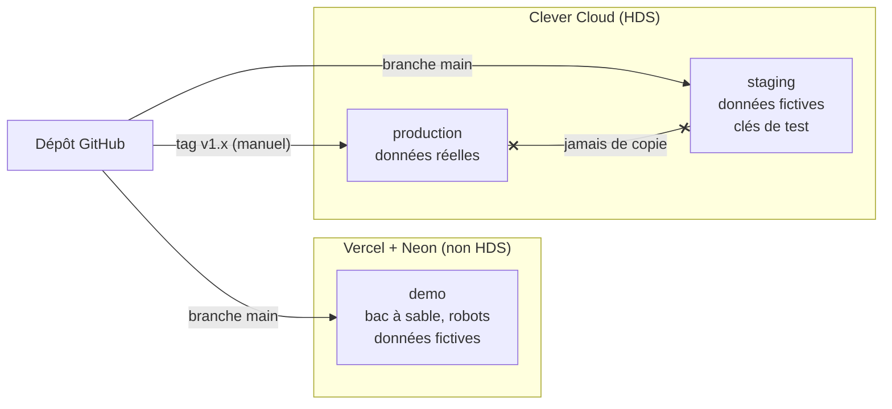

### 3.2 Mode démo pour la présentation

- Le fondateur garde une URL de démo (`demo.koudmen.fr` [À VÉRIFIER domaine]).
- Le bac à sable, les robots et « Simuler la suite » restent **dans ce seul environnement**.
- Les adaptateurs y sont **forcés en simulé**. Aucun message réel ne part de la démo.
- La démo utilise le **même code** que la production. Seule la configuration change.

### 3.3 L'interrupteur de lancement

L'interrupteur décide **qui** peut utiliser la production. Il a 4 états.

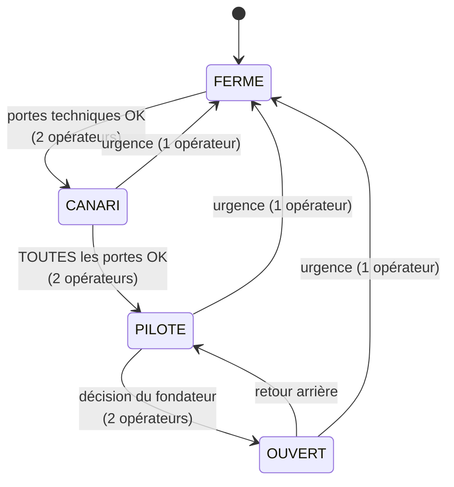

| État | Qui entre | Messages et appels réels | Paiements |
|---|---|---|---|
| `FERME` | Opérateurs seulement | Non (simulés) | Non |
| `CANARI` | Opérateurs + **comptes de l'équipe** (liste blanche) | Oui, **seulement** vers les numéros et e-mails de la liste blanche | Stripe en mode **test** |
| `PILOTE` | Familles et accompagnants **invités** par l'équipe (code d'invitation à usage unique) | Oui | Stripe en mode **réel** |
| `OUVERT` | Tout le monde (inscription libre sur le territoire) | Oui | Réel |

**Les portes de conformité** (table `LaunchGate`). Chaque porte a : un titre, une preuve (référence de document), la personne qui la coche, la date.

| Porte | Requise pour | Preuve attendue |
|---|---|---|
| G1 Hébergement HDS signé (contrat + annexe HDS) | `CANARI` | Contrat Clever Cloud |
| G2 Pentest externe sans faille critique ouverte | `CANARI` | Rapport PASSI [À VÉRIFIER prestataire] |
| G3 Sauvegarde restaurée avec succès (test) | `CANARI` | Procès-verbal de test |
| G4 **Avis écrit de l'avocat** (montage, CGU, CGV, statuts) | `PILOTE` | Avis signé |
| G5 **Réponse écrite de la DEETS** (et de la CTM si possible) | `PILOTE` | Courrier |
| G6 AIPD signée + DPO désigné + registre | `PILOTE` | Documents RGPD |
| G7 CGU, conditions familles, conditions accompagnants, politique de confidentialité, notice FALC publiées | `PILOTE` | Versions publiées |
| G8 Médiateur de la consommation + assurance RC plateforme | `PILOTE` | Attestations |
| G9 Prix loyaux validés (art. L111-7 C. conso) : « abonnement non éligible au crédit d'impôt » | `PILOTE` | Capture de l'écran Formules validée par l'avocat |
| G10 Astreinte organisée (7 h – 20 h, heure locale) et protocole d'incident | `PILOTE` | Planning d'astreinte |

Règles techniques :
1. L'état vit **en base** (`AppSetting.launchState`). Une variable d'environnement `LAUNCH_MAX_STATE` fixe un **plafond**. La base ne peut pas dépasser ce plafond. Exemple : `LAUNCH_MAX_STATE=CANARI` tant que l'avocat n'a pas répondu.
2. Monter d'un état demande **deux opérateurs différents** (principe des 4 yeux). Descendre vers `FERME` demande un seul opérateur.
3. Chaque changement est audité (`launch.state_changed`).
4. Le serveur lit l'état **à chaque requête sensible** (inscription, envoi d'un message, création d'un abonnement) via `getLaunchState()` (cache de 30 s).
5. Les adaptateurs réels refusent un envoi vers un destinataire hors liste blanche en `CANARI`.

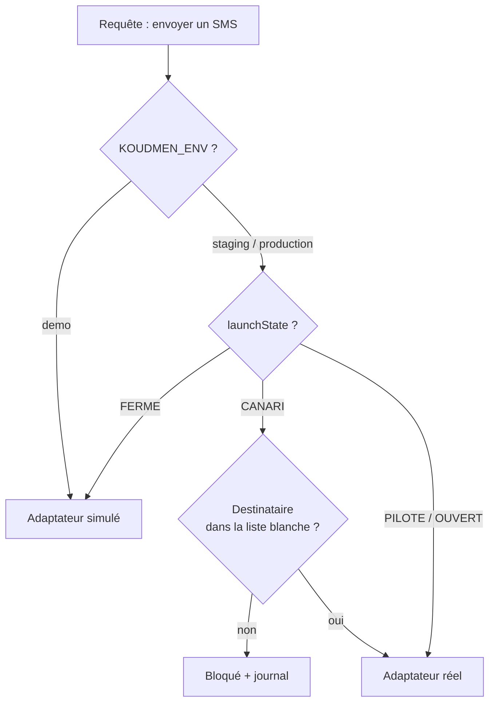

---

## 4. Comptes réels

### 4.1 Rôles

Les rôles du MVP restent : `FAMILLE`, `ACCOMPAGNANT`, `OPERATEUR`. L'aîné **n'a pas de compte**. Il agit par la voix (§ 9) et, s'il le veut, par un lien personnel en lecture (V1.1).

### 4.2 Inscription famille

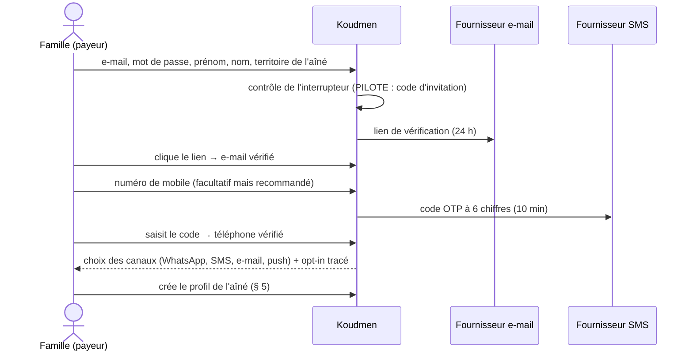

Règles :
- Âge minimum : 18 ans (case obligatoire).
- Acceptation séparée : CGU, conditions familles, politique de confidentialité (versions enregistrées).
- **Opt-in WhatsApp** explicite et tracé (`ChannelOptIn`). Exigence Meta.
- Le fuseau horaire de l'utilisateur est enregistré. Il sert aux heures calmes (§ 8.5). Exemple : un fils à Paris (UTC+1/+2) et sa mère à Fort-de-France (UTC−4).

### 4.3 Inscription accompagnant

Elle reprend l'orientation du MVP (5 questions, `orientCaregiver()`). Les vérifications deviennent réelles (§ 6).

### 4.4 Authentification

| Sujet | V1 |
|---|---|
| Mode | E-mail + mot de passe (ADR 0002 conservé). Hash `bcryptjs` 12 tours (au lieu de 10) |
| Vérification | E-mail obligatoire avant toute action. Téléphone obligatoire pour l'accompagnant |
| Mot de passe oublié | Lien à usage unique, 30 min, empreinte SHA-256 en base. Incrémente `sessionVersion` |
| 2FA opérateur | **TOTP obligatoire** (application d'authentification). Codes de secours (10, à usage unique). WebAuthn / passkeys en V1.1 |
| 2FA famille et accompagnant | Facultative en V1 (TOTP) |
| Session web | Cookie httpOnly signé (ADR 0002). Famille et accompagnant : 30 jours glissants. Opérateur : 12 h |
| Session mobile (V2) | Jeton d'accès court (15 min) + jeton de renouvellement (30 jours, rotation, révocable) |
| Alerte de connexion | E-mail « Nouvelle connexion » sur un nouvel appareil |
| Limites | Limites de débit du MVP (table `RateLimit`) + verrouillage progressif après 5 échecs |

### 4.5 Écran « Mes données » (BL-19)

- Export JSON de mes données (compte, aînés dont je suis payeur, messages reçus).
- Suppression du compte : effet à J+30, avec annulation possible. Les factures restent 10 ans (obligation légale).
- Retrait de chaque consentement (canaux, partage).

---

## 5. L'aîné et le consentement réel

### 5.1 Principe

**La famille n'a aucun pouvoir propre sur les données de l'aîné** (`docs/01` § 5.4, P3). L'aîné consent lui-même. S'il est protégé, son représentant **prouvé** consent.

Tant que le consentement n'est pas recueilli, le profil reste en `ATTENTE_CONSENTEMENT` :
- aucune demande d'accompagnement ;
- aucune visite ;
- aucun Kayé ;
- aucun appel automatique, sauf l'appel de consentement.

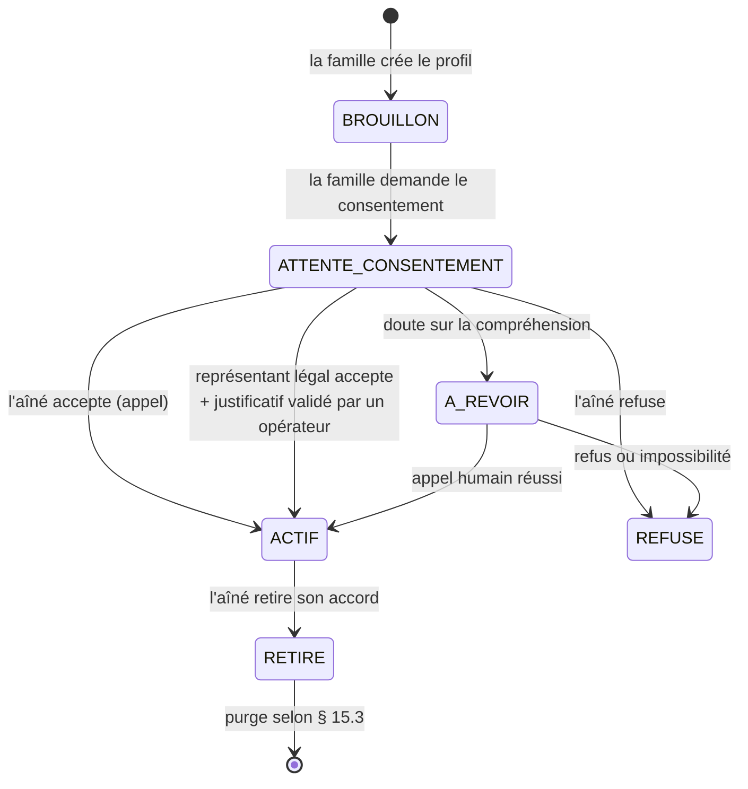

### 5.2 Situation juridique (nouveau champ)

| Valeur | Qui consent | Justificatif |
|---|---|---|
| `AUTONOME` | L'aîné | Aucun |
| `CURATELLE` | L'aîné (le curateur est informé) | Facultatif |
| `TUTELLE` | Le tuteur (avis de l'aîné recherché) | Jugement ou attestation de mesure |
| `HABILITATION_FAMILIALE` | La personne habilitée, dans les limites du jugement | Jugement |
| `MANDAT_PROTECTION_FUTURE` | Le mandataire, si le mandat est activé | Mandat visé |

Une simple procuration **ne suffit pas**. Le justificatif est stocké chiffré, vu par un opérateur, puis **supprimé à J+30** (on garde : type, date, opérateur, résultat).

### 5.3 Parcours de consentement

**Méthode par défaut : l'appel de bienvenue.** Un opérateur appelle l'aîné. Si l'opérateur n'est pas disponible, un **appel vocal automatique** propose le consentement, puis un opérateur rappelle si besoin.

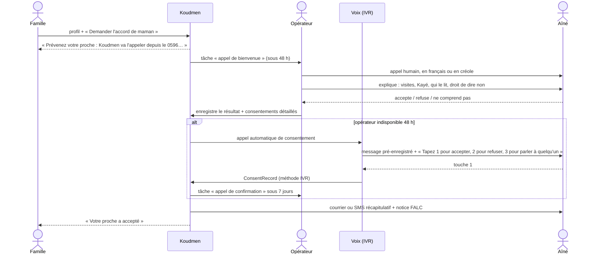

Règles :
1. **Pas d'enregistrement audio de la conversation.** On garde : date, heure, méthode, opérateur, version de la notice, réponses, durée de l'appel. [À VÉRIFIER avec le DPO : un enregistrement audio court serait-il une meilleure preuve ?]
2. **Procédure renforcée** si l'opérateur a un doute sur la compréhension : état `A_REVOIR`, deuxième appel, puis refus si le doute persiste. L'opérateur n'évalue **jamais** la santé : il note « compréhension incertaine », sans diagnostic.
3. Le consentement est **granulaire** (`ConsentRecord.scope`) :

| Portée | Par défaut | Peut être retiré |
|---|---|---|
| `VISITES` (organisation des visites, preuve) | Requis | Oui (fin du service) |
| `KAYE_PARTAGE` (partage du Kayé avec le cercle) | Proposé | Oui |
| `KAYE_PHOTOS` | Non | Oui |
| `APPELS_AUTOMATIQUES` (confirmation de visite, Kozé) | Proposé | Oui |
| `GPS_CHECKIN` (géocodage du domicile) | Proposé | Oui |
| `PARTAGE_SECOURS` (secours, CCAS en mode cyclone, V1.1) | Proposé | Oui |

4. **L'aîné choisit son cercle.** Il peut exclure un membre du cercle Lakou de la lecture du Kayé (`LakouMember.kayeAccess = false`). Un membre exclu n'est pas prévenu du motif.
5. **Retrait à tout moment** : par la voix (ligne entrante, touche dédiée), par un opérateur, ou par la famille sur demande de l'aîné (journalisé).

### 5.4 Données minimales de l'aîné

| Donnée | Stockage | Pourquoi |
|---|---|---|
| Prénom, initiale du nom | Clair | Affichage |
| Nom complet | **Chiffré** (champ) | Courrier, appel de bienvenue |
| Téléphone (fixe ou mobile) | **Chiffré** | IVR |
| Adresse | **Chiffrée** | Géocodage, si `GPS_CHECKIN` |
| Position du domicile | Arrondie à 4 décimales (~10 m) [À VÉRIFIER], chiffrée | Facteur GPS |
| Langue des appels | Clair (`fr`, `gcf-mq`, `gcf-gp`) | Choix des messages |
| Besoins | Catégories fermées, non médicales | Matching |
| Situation juridique | Clair | Consentement |
| Autonomie APA (oui / non / en cours) | Clair | Alerte « enfant employeur » (`docs/08` § 2.2) |

**Aucun** champ médical libre. Aucun NIR. Aucun GIR détaillé.

---

## 6. Accompagnant : vérifications réelles

### 6.1 Principe

Les badges décrivent **des faits vérifiés**. Ils ne notent pas la personne. Ils ne servent jamais à classer ou sanctionner (`docs/08` § 3.4).

En V1, la vérification est **humaine**, en visio, **sans copie** des pièces. Un adaptateur `IdentityVerificationPort` permet de brancher un prestataire PVID (Ubble, IDnow) en V1.1.

### 6.2 Les vérifications par statut

| Vérification | Méthode V1 | Ce qu'on garde | Durée de validité | Statuts |
|---|---|---|---|---|
| **Identité** | Visio de 20 min. L'accompagnant montre sa pièce. L'opérateur compare le visage | Type de pièce, 4 derniers caractères du numéro, date, opérateur, résultat | Relation | Tous |
| **Casier B3** | L'accompagnant demande son B3 en ligne (gratuit) et le **montre** en visio | « B3 vu le JJ/MM, daté du JJ/MM, mention néant : oui/non », opérateur | 1 an (renouvellement) | Tous |
| **Attestation d'honorabilité** | Si l'accès existe (décret 2026-324) [À VÉRIFIER] | Date, résultat | Selon le texte | Tous, dès que possible |
| **2 références** | L'opérateur appelle 2 personnes (ancien employeur, famille aidée) | Nom de la référence, date, « favorable : oui/non ». Pas de compte rendu libre | Relation | Niveaux 2 et 3 |
| **Formation Koudmen** | Modules en ligne + QCM (§ 6.4) | Module, date, score | 2 ans [À VÉRIFIER] | Selon D9 (§ 6.4) |
| **PSC1** | Certificat montré en visio | Date du certificat, organisme | 2 ans [À VÉRIFIER] | Niveau 3 (`docs/08` § 4.2) |
| **SIRET actif** | API Sirene (INSEE), automatique | SIRET, état actif, date | Contrôle mensuel | AE |
| **Déclaration SAP (NOVA)** | Récépissé montré en visio. Activités notées | Numéro, activités déclarées | Contrôle annuel | AE |
| **RC professionnelle** | Attestation montrée en visio | Assureur, date de fin | Jusqu'à expiration (relance J-30) | AE |
| **Diplôme** (DEAES, ADVF) | Pièce montrée en visio | Type, date | Permanent | Niveau 4 |

Règles :
- **Ne jamais stocker** une copie de la pièce d'identité ou du B3 (art. 10 RGPD). Le formulaire n'a **pas** de champ de téléchargement pour ces deux pièces.
- Les vérifications expirées déclenchent une relance (J-30, J-7). À l'expiration, l'accompagnant ne reçoit plus de **nouvelles** propositions. Les accords en cours restent décidés par la famille (D5).
- Chaque décision de l'opérateur a un motif dans une liste fermée (R6).

### 6.3 Cycle d'un accompagnant (rappel + ajouts)

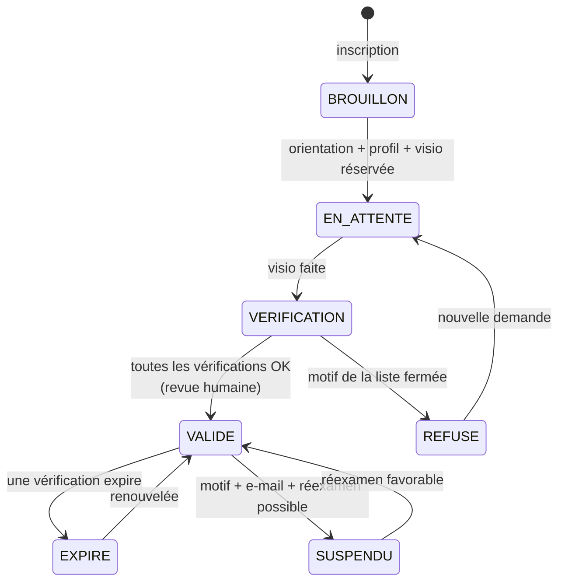

### 6.4 Formation

- La décision **D9** (formation obligatoire pour tous) reste. Elle contredit `docs/01` § 3.3 pour l'AE (indice de subordination, P11). **[À VÉRIFIER AVEC L'AVOCAT, porte G4]**.
- Le code rend ce choix **configurable par statut** (`TRAINING_REQUIRED_BY_STATUS`). Si l'avocat tranche, on change la configuration, pas le code.
- Contenu (`docs/08` § 4.2) : bientraitance et 3977, abus financier, limites du rôle, preuve de visite, Kayé, SOS.
- V1 : pages de formation dans l'application + QCM. Le PSC1 se fait chez un organisme agréé (hors plateforme).

### 6.5 Limites d'activité appliquées par le code

- Pas de niveau 4 sans diplôme validé (MVP).
- Niveau 3 : âge minimum 21 ans (`docs/08` § 4.2, proposition) [À VÉRIFIER].
- Débutant : **3 familles au plus** le premier mois.
- Pas de mission de nuit en V1.
- Statuts `SAAD` et `BENEVOLE_ASSO` individuels : **liste d'attente** en V1 (P9, P10). Les comptes « organisation » arrivent en V1.1.

---

## 7. Paiements

> Décision détaillée : [ADR 0004](adr/0004-paiements-abonnement-stripe-heures-hors-plateforme.md).

### 7.1 Qui paie quoi

| Flux | Qui paie | Qui reçoit | Par où | Crédit d'impôt |
|---|---|---|---|---|
| **Abonnement Koudmen** (Kozé, Sérénité) | Le payeur de la famille | **Koudmen** | **Stripe Billing** (carte, SEPA en option) | **Non** (frais d'un intermédiaire non déclaré SAP) [À VÉRIFIER par rescrit] |
| **Heures d'un salarié de la famille** (voie B) | L'employeur (l'aîné ou l'enfant) | Le salarié | **CESU+ (URSSAF)**, hors plateforme | Oui, 50 %, avance immédiate dans CESU+ (sauf APA avant 07/2027) |
| **Heures d'un AE déclaré SAP** (voie A, niveau 2) | Le client (l'aîné ou l'enfant) | L'AE | **Hors plateforme** : virement, CESU préfinancé, ou logiciel habilité de l'AE (avance immédiate) | Oui si l'activité est éligible |
| **Accompagnant → Koudmen** | — | — | **Aucun flux** | — |

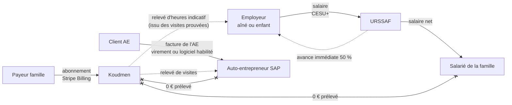

### 7.2 Décision sur les heures : hors plateforme en V1

**Koudmen n'encaisse pas l'argent des heures en V1.** Justification juridique :

1. **Salarié de la famille (cœur du pilote).** Le salaire passe par CESU+. L'URSSAF prélève l'employeur et paie le salarié. Si Koudmen encaissait le salaire puis le reversait, Koudmen ferait un **acte de gestion de mandataire** (agrément DEETS) et un **service de paiement** (art. L314-1 CMF). Un PSP comme Stripe porte le second risque, **pas** le premier (P1, P5).
2. **0 € prélevé sur l'accompagnant.** Stripe Connect sert surtout à retenir une commission (`application_fee`). Sans commission, il n'apporte pas de revenu, mais il ajoute : un KYC de chaque accompagnant, des frais par compte actif, et un indice de contrôle du travail (paiement retenu jusqu'à validation).
3. **Avance immédiate.** Pour l'AE, l'URSSAF verse 100 % à l'AE. Un rail Stripe en parallèle crée deux circuits et un risque de double paiement.
4. **Risque politique.** Les amendements contre l'avance immédiate « plateforme + micro-entrepreneur » visent ce schéma (`docs/05` § 4.4). Rester hors du flux limite l'exposition.
5. **Simplicité.** Moins de conformité (LCB-FT, DAC7 sur les paiements, précompte 2027) à porter en V1. [À VÉRIFIER : DAC7 et précompte s'appliquent-ils même quand le paiement ne passe pas par la plateforme ? Question à l'avocat]

Le module `HoursPaymentPort` existe quand même, avec une seule implémentation `HorsPlateforme`. Une implémentation `StripeConnect` reste possible en V2 **après avis écrit de l'avocat** (cas SAAD, B2B, ou mandataire agréé).

### 7.3 Abonnement famille : flux Stripe Billing

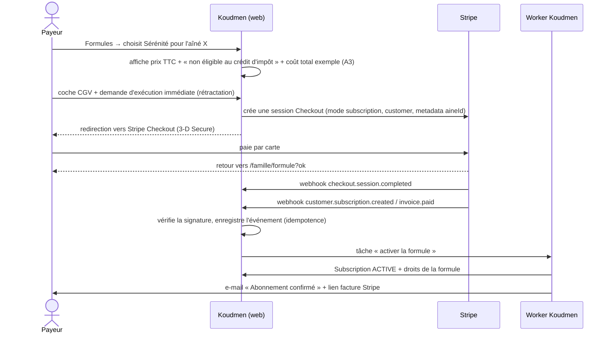

Règles :
1. **Koudmen ne voit jamais un numéro de carte.** Paiement sur Stripe Checkout (hébergé). Gestion par le **portail client Stripe** (changer de carte, résilier, factures).
2. **Une formule par aîné.** Un seul payeur par aîné en V1. Le payeur peut changer plus tard (V1.1).
3. **Webhooks** : signature vérifiée, table `WebhookEvent` (identifiant unique), traitement dans le worker, rejouable.
4. **Échec de paiement** : relances automatiques Stripe (Smart Retries) + message `PAIEMENT_ECHOUE`. Après la dernière relance : retour à la formule Libre **en fin de période**.
5. **Sécurité avant tout** : les alertes de sécurité (incident, SOS, touche 2 de l'IVR) partent **quelle que soit la formule**, même impayée.
6. **Résiliation en 3 clics** (art. L215-1-1 C. conso) : bouton « Résilier » dans `/famille/formule`, puis le portail Stripe. Effet en fin de période.
7. **Rétractation de 14 jours** (L221-18) : si le payeur demande l'exécution immédiate, remboursement au prorata. Remboursement par un opérateur, depuis l'espace opérateur (audit).
8. **Factures** : émises par Stripe au nom de Koudmen (SIREN, adresse, TVA). Mention « Abonnement à des services numériques. Non éligible au crédit d'impôt pour l'emploi d'un salarié à domicile. »
9. **TVA** : taux selon le lieu d'établissement de Koudmen et la nature du service (8,5 % en Martinique, 20 % en Hexagone ?). **[À VÉRIFIER avec l'expert-comptable]**. Option : Stripe Tax.
10. **Mode test** : `CANARI` utilise les clés de test Stripe. `PILOTE` et `OUVERT` utilisent les clés réelles.

### 7.4 Les formules (contenu à confirmer)

| Formule | Prix TTC | Contenu proposé (V1) |
|---|---|---|
| **Libre** | 0 € | Cercle Lakou, profil de l'aîné, demande d'accompagnement, choix du profil, preuve de visite (GPS + code), relevé d'heures |
| **Kozé** | 39 €/mois [À VÉRIFIER] | Libre + appel automatique hebdomadaire « Tout va bien ? » + alertes WhatsApp/SMS si pas de réponse |
| **Sérénité** | dès 149 €/mois [À VÉRIFIER] | Kozé + **appel de confirmation après chaque visite** + Kayé détaillé (photos si accord) + aide pour trouver un remplaçant (**sans garantie**, P1) + relevé mensuel détaillé |

ATTENTION : Sérénité paie **seulement des services numériques** (option A de P1). Elle ne paie **aucune** heure de visite. Le contenu final dépend de la porte G4 (avocat) et G9 (prix loyaux).

Les droits par formule vivent dans `src/lib/plans.ts` (`PLAN_ENTITLEMENTS`). Le code teste un **droit** (`hasEntitlement(aine, "APPEL_CONFIRMATION")`), jamais un nom de formule.

### 7.5 Relevé d'heures

Le relevé d'heures remplace « préparer la déclaration » (R8).

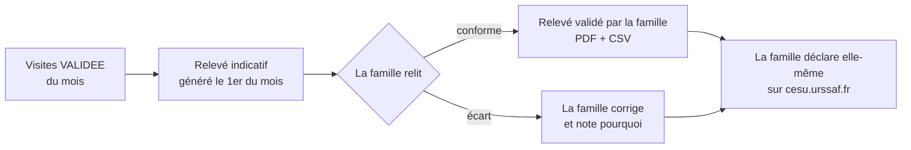

- Contenu : date, heure de début et de fin, durée, facteurs de preuve, accompagnant, tarif convenu, total indicatif.
- Visites `A_VERIFIER` : affichées à part. **La famille décide** si elle les compte (P6).
- Mention fixe : « Relevé indicatif. Koudmen ne déclare pas à votre place. Vous déclarez vous-même sur cesu.urssaf.fr. »
- Pour l'AE : le même relevé l'aide à faire **sa** facture dans **son** logiciel.

---

## 8. Notifications

> Décision détaillée : [ADR 0005](adr/0005-notifications-et-voix.md).

### 8.1 La passerelle de conversation

Le métier émet une **intention** (ex. `KAYE_PUBLIE`). La passerelle choisit le canal, applique les règles (opt-in, heures calmes, liste blanche) et gère le repli.

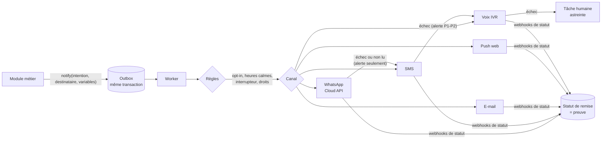

Règles :
1. **Outbox transactionnelle.** Le message s'écrit dans la **même transaction** que l'événement métier. Le worker l'envoie ensuite. Aucune alerte n'est perdue.
2. **Statuts** : `EN_ATTENTE` → `ENVOYE` → `REMIS` → `LU` (si le canal le dit) ou `ECHEC`. Le MVP `ENVOYE_SIMULE` reste pour les adaptateurs simulés.
3. **Idempotence** : une clé `dedupeKey` (intention + entité + destinataire) empêche un double envoi (BL-1).
4. **Tentatives** : 3 essais avec délai croissant (1 min, 5 min, 30 min), puis repli.
5. Chaque message garde : canal, fournisseur, identifiant du fournisseur, horodatages, statut. C'est une **preuve** en cas de litige (`docs/05` § 3.1).

### 8.2 Choix du canal par intention

| Intention | Destinataire | 1er canal | Repli | Urgence |
|---|---|---|---|---|
| `CODE_VERIFICATION` | Tout utilisateur | SMS | — | Immédiat |
| `VERIFICATION_EMAIL`, `MOT_DE_PASSE` | Tout utilisateur | E-mail | — | Immédiat |
| `INVITATION_LAKOU` | Invité | E-mail ou lien partagé | — | Normal |
| `PROFILS_PROPOSES` | Payeur | WhatsApp | E-mail | Normal |
| `PROPOSITION_MISSION` | Accompagnant | Push | WhatsApp → SMS | Normal |
| `PROPOSITION_ACCEPTEE` / `REFUSEE` (anonyme) | Payeur | WhatsApp | E-mail | Normal |
| `RAPPEL_VISITE` (J-1, 18 h) | Accompagnant | Push | SMS | Normal |
| `VISITE_VALIDEE` | Employeur (s'il le demande, P7) | WhatsApp | Push | Faible |
| `VISITE_A_VERIFIER` | Employeur | WhatsApp | E-mail | Normal |
| `KAYE_PUBLIE` | Cercle (membres autorisés par l'aîné) | WhatsApp | Push → e-mail | Normal |
| `ALERTE_A_SURVEILLER` | Cercle autorisé | WhatsApp **et** push | SMS | Élevée |
| `INCIDENT_P1_P2` | Payeur + astreinte | SMS **et** appel vocal | Tâche humaine | **Critique**, ignore les heures calmes |
| `APPEL_AINE_SANS_REPONSE` (Kozé) | Payeur | WhatsApp | SMS | Élevée |
| `ACCOMPAGNANT_VALIDE` / `REFUSE` / `SUSPENDU` | Accompagnant | **E-mail** (support durable, P2B) | + WhatsApp court | Normal |
| `ABONNEMENT_CONFIRME`, `PAIEMENT_ECHOUE`, `RESILIATION` | Payeur | E-mail | WhatsApp | Normal |
| `RELEVE_HEURES_DISPONIBLE` | Employeur | E-mail | WhatsApp | Faible |

### 8.3 Fournisseurs recommandés (UE d'abord)

| Canal | Fournisseur V1 | Alternative | Pourquoi |
|---|---|---|---|
| WhatsApp | **Meta WhatsApp Business Cloud API, en direct** | 360dialog (BSP, Allemagne) | Pas de surcoût de BSP. Webhook direct |
| E-mail | **Brevo** (France) | Scaleway TEM (France) | Société française, DPA en France, e-mail + SMS dans un seul outil |
| SMS | **Brevo SMS** | OVHcloud SMS ; Twilio en secours | Prix France, société française. **Test de remise vers 0696 / 0690 obligatoire en `CANARI`** |
| Voix (IVR) | **Twilio Programmable Voice** | Vonage Voice API ; jambonz auto-hébergé (V2) | Seule offre mûre pour l'IVR programmable avec DTMF, statuts et SIP |
| Push web | **Web Push (VAPID)**, sans fournisseur | — | Standard. Aucun tiers. Gratuit |
| Push mobile (V2) | Expo Push → APNs / FCM | FCM direct | Contenu sans donnée personnelle |

Comparaison SMS et voix (ordres de grandeur, tous **[À VÉRIFIER]** sur devis et grille du jour) :

| Critère | **Twilio** | **Vonage** | **OVHcloud** | **Brevo** |
|---|---|---|---|---|
| Siège / données | États-Unis (DPF, région UE partielle) | Suède (Ericsson) / infra US | **France** | **France** |
| SMS vers +33 6 | ~0,08 $ | ~0,07 – 0,09 € | ~0,06 – 0,08 € | ~0,045 – 0,07 € (dégressif) |
| SMS vers +596 696 / +590 690 | ~0,10 – 0,20 $ (Réunion ~0,19 $, `docs/05`) | Inconnu | Inconnu | Inconnu |
| Émetteur alphanumérique « Koudmen » | Oui en France ; peut être réécrit en DROM (`docs/05` § 3.3) | Oui | Oui | Oui |
| Voix programmable (IVR, DTMF) | **Oui, très mûre** (TwiML `<Gather>`, `<Play>`) | **Oui** (NCCO `input`) | **Non** (SVI configurable, pas d'API d'appel sortant programmable) [À VÉRIFIER] | **Non** |
| Appel sortant vers un fixe ou mobile Martinique | ~0,05 – 0,30 $/min | ~0,05 – 0,30 €/min | Via ligne SIP | — |
| Numéro 0596 / 0590 | Non confirmé (`docs/05` § 3.4) ; possible en **BYOC** (numéro d'un opérateur local relié par SIP) | Non confirmé | Numéros géographiques DOM non confirmés via API | — |
| WhatsApp | Oui (BSP, surcoût) | Oui (BSP) | Non | Oui (campagnes, surcoût) |
| Verdict V1 | **Voix** + SMS de secours | Alternative voix | SIP trunk possible pour le numéro local | **E-mail + SMS** |

### 8.4 Modèles de messages (V1)

Règles d'écriture :
- Vouvoiement. Phrases courtes. Un lien vers l'espace connecté.
- **Aucune donnée de santé.** Pas le prénom de l'aîné dans WhatsApp et SMS : on écrit « votre proche ». [À VÉRIFIER avec le DPO : le prénom seul serait-il acceptable ?]
- **SMS en alphabet GSM-7** pour tenir en 160 caractères. Les lettres `ê`, `â`, `î`, `ô`, `ç` (minuscule) passent le SMS en UCS-2 (70 caractères, prix doublé). Le module SMS les remplace (`ê` → `e`). Les lettres `é`, `è`, `à`, `ù` sont permises.
- Catégorie WhatsApp : **utilitaire** pour tout, sauf `CODE_VERIFICATION` (**authentification**). **Aucun** modèle marketing en V1.

| Modèle | Canal | Texte (variables entre `{{ }}`) |
|---|---|---|
| `KAYE_PUBLIE` | WhatsApp (utilitaire) | « Bonjour {{prenom}}. Un nouveau Kayé est disponible pour votre proche. Lisez-le dans votre espace Koudmen : {{lien}} » |
| `ALERTE_A_SURVEILLER` | WhatsApp + push | « Bonjour {{prenom}}. L'accompagnant a noté un point à surveiller lors de la visite d'aujourd'hui. Détails dans votre espace : {{lien}}. Urgence : appelez le 15 ou le 112. » |
| `ALERTE_A_SURVEILLER` | SMS (GSM-7) | « Koudmen : un point a surveiller a ete note lors de la visite. Voir votre espace : {{lien_court}}. Urgence : 15 ou 112. » |
| `VISITE_A_VERIFIER` | WhatsApp | « La visite du {{date}} n'a pas pu être confirmée automatiquement. Vous pouvez vérifier et décider dans votre espace : {{lien}} » |
| `PROPOSITION_MISSION` | Push / WhatsApp | « Une famille vous propose un accompagnement à {{commune}}, {{creneau}}. Vous êtes libre d'accepter ou de refuser, sans aucune conséquence. Voir : {{lien}} » |
| `RAPPEL_VISITE` | Push / SMS | « Rappel : visite demain à {{heure}} à {{commune}}. Pensez à faire le check-in à votre arrivée. » |
| `PROFILS_PROPOSES` | WhatsApp | « Koudmen vous propose {{n}} profil(s) pour votre demande. C'est vous qui choisissez : {{lien}} » |
| `APPEL_AINE_SANS_REPONSE` | WhatsApp | « Votre proche n'a pas répondu à l'appel de {{heure}} (2 essais). Vous pouvez l'appeler ou prévenir un voisin. Détails : {{lien}} » |
| `INCIDENT_P1_P2` | SMS | « Koudmen URGENT : un incident concerne votre proche. L'astreinte vous appelle. Si danger immediat : 15 ou 112. » |
| `CODE_VERIFICATION` | SMS / WhatsApp (authentification) | « Votre code Koudmen : {{code}}. Il expire dans 10 minutes. Ne le donnez à personne. » |
| `ACCOMPAGNANT_SUSPENDU` | E-mail | Motif (liste fermée), effets, date, **lien « Demander un réexamen »**, délai de réponse, contact humain |
| `PAIEMENT_ECHOUE` | E-mail | Montant, date de nouvel essai, lien vers le portail de paiement. Rappel : « Les alertes de sécurité continuent. » |

Les modèles WhatsApp sont **soumis à Meta** avant usage (approbation de quelques minutes à 24 h [À VÉRIFIER]). Le code garde le nom et la langue du modèle approuvé (`notification-templates.ts` + `whatsappTemplateName`).

### 8.5 Heures calmes et préférences

- Heures calmes **par destinataire**, dans **son** fuseau : 21 h – 8 h. Les messages non urgents attendent.
- Les incidents P1-P2 ignorent les heures calmes.
- Chaque utilisateur choisit ses canaux. Le désabonnement d'un canal est immédiat (réponse « STOP » sur WhatsApp ou SMS, lien dans l'e-mail).
- La fenêtre gratuite de 24 h de WhatsApp est utilisée : un bouton « OK » dans le message invite à répondre. La réponse ouvre la fenêtre de service (`docs/05` § 3.2).

---

## 9. Appel vocal de l'aîné (IVR)

> Décision détaillée : [ADR 0005](adr/0005-notifications-et-voix.md).

### 9.1 Les parcours vocaux V1

| Parcours | Déclencheur | Droit requis | Consentement requis |
|---|---|---|---|
| **Confirmation de visite** « tapez 1 » | Check-out de l'accompagnant (+ 5 min) | Formule Sérénité, ou visite non prouvée par 2 facteurs | `APPELS_AUTOMATIQUES` |
| **Consentement** | Demande de la famille, opérateur indisponible 48 h | — | — (c'est l'objet de l'appel) |
| **Kozé** « Tout va bien ? » | Hebdomadaire, jour et heure choisis par l'aîné | Formule Kozé ou Sérénité | `APPELS_AUTOMATIQUES` |
| **Ligne entrante** | L'aîné appelle le numéro local | — | — |

### 9.2 Flux technique : confirmation de visite

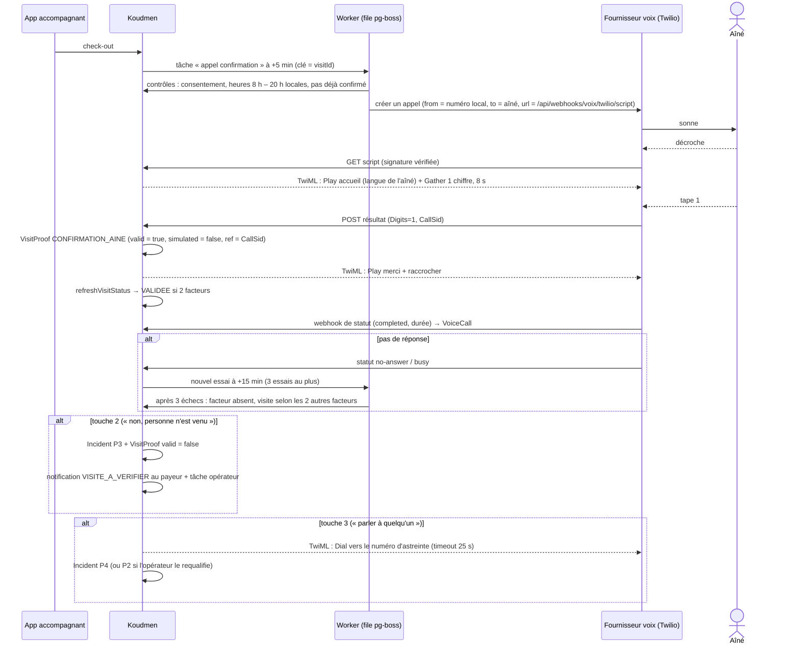

Règles :
1. **Signature** de chaque webhook vérifiée (`X-Twilio-Signature`). Réponse refusée sinon.
2. **Idempotence** par `CallSid`. Un même résultat n'écrit qu'une preuve.
3. **Plage horaire** : 8 h – 20 h **heure de l'aîné** (America/Martinique, America/Guadeloupe). Hors plage, l'appel attend le lendemain 9 h.
4. **Pas de répondeur** : si le fournisseur détecte une messagerie (AMD), l'appel raccroche sans message. [À VÉRIFIER coût de la détection AMD]
5. **Pas de donnée personnelle** dans les messages : pas de nom de l'aîné, pas de nom de l'accompagnant. Phrase type : « Bonjour. Ici Koudmen. Une visite chez vous vient de se terminer. Si la personne est bien venue, tapez 1. Si personne n'est venu, tapez 2. Pour parler à quelqu'un, tapez 3. »
6. Pas de répétition infinie : 2 lectures du menu, puis « Nous vous rappellerons. Au revoir. »
7. **L'opérateur ne peut pas saisir** la confirmation à la main en production (P6). Le bouton du MVP n'existe qu'en `demo`.

### 9.3 Messages pré-enregistrés

| Identifiant | Usage | Langues |
|---|---|---|
| `ACCUEIL` | « Bonjour. Ici Koudmen. » | fr, gcf-mq, gcf-gp |
| `VISITE_QUESTION` | Menu 1 / 2 / 3 de la confirmation | fr, gcf-mq, gcf-gp |
| `KOZE_QUESTION` | « Tout va bien aujourd'hui ? Tapez 1 pour oui. Tapez 2 si vous voulez qu'on vous rappelle. » | fr, gcf-mq, gcf-gp |
| `CONSENTEMENT_EXPLICATION` + `CONSENTEMENT_QUESTION` | Appel de consentement (60 s au plus) | fr, gcf-mq, gcf-gp |
| `MERCI`, `PAS_COMPRIS`, `TRANSFERT`, `AU_REVOIR`, `HORS_SERVICE` | Messages courts | fr, gcf-mq, gcf-gp |

- Enregistrement par des **voix locales** (comédien ou bénévole), avec **cession de droits écrite**. Format : WAV 8 kHz mono ou MP3. [À VÉRIFIER format optimal du fournisseur]
- Stockage : stockage objet, **public en lecture** (les fichiers ne contiennent aucune donnée personnelle), avec un nom versionné (`voix/v1/gcf-mq/VISITE_QUESTION.mp3`).
- Pas de synthèse vocale en V1 (pas de TTS américain sur des données personnelles, et la voix humaine rassure).
- Le texte des messages est validé par une personne créolophone du territoire.

### 9.4 Incidents

| Niveau | Déclencheur V1 | Délai | Actions automatiques |
|---|---|---|---|
| **P1** Danger immédiat | SOS de l'accompagnant (appui long) | < 5 min | SMS + appel à l'astreinte, puis au payeur. Rappel « 15 / 112 » à l'écran |
| **P2** Suspicion d'abus | Signalement (accompagnant, famille, opérateur), requalification d'un P3/P4 | < 2 h | Tâche opérateur. Suspension **préventive** seulement par décision humaine motivée |
| **P3** Incident de service | Touche 2 de l'IVR, absence de check-in à H+30 min | < 24 h | Notification au payeur, tâche opérateur |
| **P4** Qualité | Touche 3 de l'IVR, demande de rappel Kozé | < 72 h | Tâche opérateur |

Le registre des incidents est un module à part (`src/server/incidents/`). Il est chiffré et réservé aux opérateurs.

### 9.5 Numéro affiché et cadre ARCEP

- **Cible** : un numéro **géographique local** (0596 en Martinique, 0590 en Guadeloupe). Un aîné décroche plus volontiers un numéro local (peur des arnaques, `docs/05` § 3.4).
- **Plan A** : numéro attribué par un opérateur français ou local (OVHcloud, opérateur des Antilles), relié en **SIP** à Twilio (« Bring Your Own Carrier »). [À VÉRIFIER disponibilité et délai]
- **Plan B** : numéro national (09) ou mobile via Twilio, avec nom d'appelant cohérent.
- **ATTENTION — Plan de numérotation ARCEP.** Les **systèmes automatisés d'appel** doivent peut-être utiliser des **tranches de numéros dédiées**, et non un numéro géographique. De plus, le dispositif d'**authentification des numéros (MAN)** coupe les appels VoIP dont le numéro n'est pas authentifié. **[À VÉRIFIER avec l'opérateur et l'avocat avant de commander le numéro]**. Si le 0596 est interdit pour des appels automatiques, on utilise la tranche dédiée et on **prévient l'aîné à l'avance** (appel de bienvenue humain + carte « Koudmen vous appelle depuis le … » posée près du téléphone).
- Le même numéro reçoit les appels entrants (ligne de l'aîné vers l'astreinte).

### 9.6 Kozé : appel hebdomadaire

- L'aîné choisit le jour et l'heure pendant l'appel de bienvenue.
- Touche 1 : « Tout va bien » → message court au cercle (si l'aîné l'a accepté).
- Touche 2 : tâche « rappel humain » sous 24 h.
- Pas de réponse après 2 essais (30 min d'écart) : `APPEL_AINE_SANS_REPONSE` au payeur. **Koudmen ne déclenche pas les secours** sur une absence de réponse. Il prévient la famille, qui décide.

### 9.7 Coûts de la voix (ordre de grandeur)

| Poste | Hypothèse | Coût [À VÉRIFIER] |
|---|---|---|
| Appel de confirmation | 45 s, facturé 1 min, vers fixe ou mobile Martinique | 0,05 à 0,30 $ par appel |
| Essais | 1,3 appel par visite en moyenne | × 1,3 |
| Kozé | 1 appel par semaine et par aîné | 0,2 à 1,3 $ par mois et par aîné |
| Numéro local | Location mensuelle + SIP | 1 à 15 € par mois et par numéro |
| Détection de répondeur | Option par appel | ~0,0075 $ par appel |
| **Exemple** | 2 000 visites par mois (≈ 450 par semaine, cible M12) | **~130 à 800 $ par mois** |

---

## 10. PWA : le web mobile installable

> Décision détaillée : [ADR 0006](adr/0006-pwa-puis-expo.md).

### 10.1 Ce que la PWA fait

| Capacité | Famille | Accompagnant | Technique |
|---|---|---|---|
| **Installable** (icône sur l'écran d'accueil) | Oui | Oui | `manifest.webmanifest`, icônes, `display: standalone` |
| **Notifications push** | Oui | Oui | Web Push + VAPID. iOS 16.4+ : **seulement une fois installée** |
| **Hors ligne : lecture** | Dernier état du fil Kayé (sans photo) | Visites des 7 prochains jours (prénom, commune, horaires, consignes d'accès) | Service worker (Serwist) + IndexedDB |
| **Hors ligne : écriture** | Non | Check-in, preuve par code, check-out, brouillon de Kayé | File d'événements locale, synchronisée au retour du réseau |
| **Scanner un QR code** | Non | Oui (code du domicile) | Caméra (`getUserMedia`) + décodeur JS, fonctionne hors ligne |
| **Position au check-in** | Non | Oui (une fois, après accord) | `getCurrentPosition` (R4) |

### 10.2 Hors ligne pour l'accompagnant

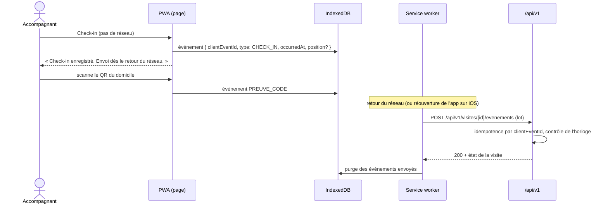

Règles :
1. **Idempotence** : chaque événement a un `clientEventId` (UUID v4). Le serveur ignore un doublon.
2. **Horloge** : le serveur garde `occurredAt` (appareil) et `receivedAt` (serveur). Un écart de plus de 12 h passe la visite en `A_VERIFIER` [À VÉRIFIER seuil].
3. **Données en cache minimales** : prénom de l'aîné, commune, horaires, consignes d'accès. **Jamais** le Kayé passé, jamais le téléphone. Le cache est effacé à la déconnexion.
4. **Synchronisation** : Background Sync sur Android Chrome. Sur iOS (pas de Background Sync), la file part à la réouverture de l'application.
5. **Code du domicile** : le QR code contient un **jeton signé** du domicile, pas un code lisible. Il tourne chaque mois (BL-16) [À VÉRIFIER : faut-il un code par visite ?].

### 10.3 Installation et push

- Une invite d'installation apparaît **après** une action réussie (première visite, premier Kayé lu), jamais à l'arrivée.
- Sur iOS, un écran montre les 3 gestes (Partager → « Sur l'écran d'accueil » → Ajouter). Le push iOS ne marche **qu'après** l'installation.
- Le contenu d'une notification push suit R9 : titre générique + lien.
- `PushSubscription` est lié à l'appareil. Il est supprimé si le navigateur renvoie 404 ou 410.

---

## 11. App native (Expo) : plan pour la V2

> Décision détaillée : [ADR 0006](adr/0006-pwa-puis-expo.md).

### 11.1 Quand passer à Expo

On démarre l'app native quand **une** de ces conditions est vraie :

| Déclencheur | Mesure |
|---|---|
| Push iOS insuffisant | Moins de 60 % des accompagnants iOS ont installé la PWA [À VÉRIFIER seuil] |
| Hors ligne insuffisant | Plus de 5 % des visites en `A_VERIFIER` à cause d'une synchronisation tardive |
| Besoin du NFC | Décision de passer aux tags NFC (iOS ne permet pas le Web NFC) |
| Besoin de fiabilité en arrière-plan | SOS et minuteur de visite exigent une app native |
| Exigence d'un partenaire | CTM, mutuelle ou SAAD demande une app des stores |

### 11.2 Ce qu'on prépare dès la V1 (sans coût)

1. **API versionnée** `/api/v1/*` (route handlers), contrats Zod, document OpenAPI généré. La PWA hors ligne l'utilise déjà.
2. **Domaine pur** : `src/server/rules/**` et `src/server/visits/proof.ts` restent du TypeScript sans Prisma ni Next.js. Ils deviendront un paquet partagé.
3. **Authentification par jeton** prête (§ 4.4) pour le mobile.
4. **Push abstrait** : `PushPort` accepte un abonnement Web Push **ou** un jeton Expo.

### 11.3 Étapes Expo

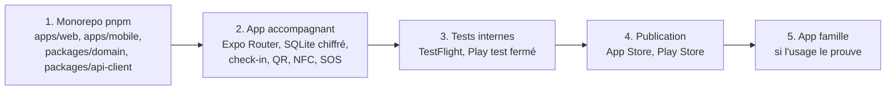

- **App accompagnant d'abord** (hors ligne, SOS, NFC). L'app famille vient seulement si l'usage le prouve (`docs/05` § 3.5).
- EAS Build et EAS Update (mise à jour OTA). Les services Expo sont aux États-Unis : **aucune donnée personnelle** dans les builds et les notifications push.
- Base locale chiffrée (SQLCipher) pour les visites hors ligne.

---

## 12. Hébergement

> Décision détaillée : [ADR 0007](adr/0007-hebergement-hds-clever-cloud.md).

### 12.1 Cible

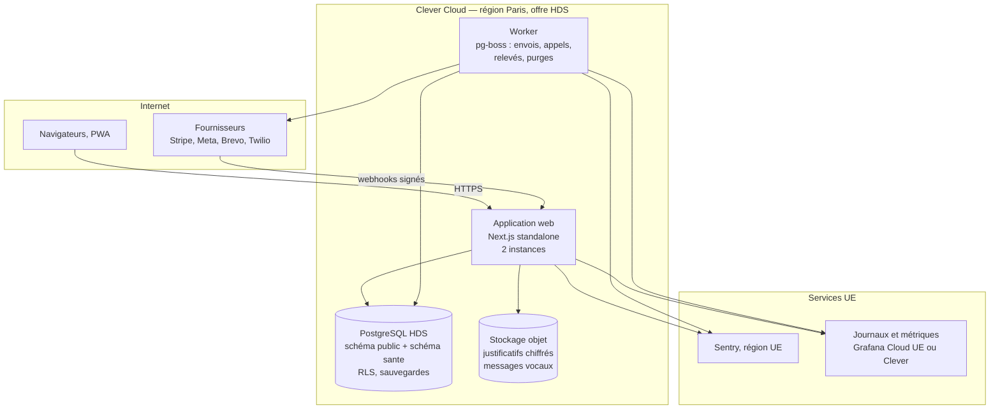

| Élément | Choix V1 |
|---|---|
| Application | Next.js en mode `standalone`, Node 22, 2 instances (Clever Cloud) |
| Worker | Même dépôt, autre point d'entrée (`pnpm worker`), 1 instance |
| File de tâches | **pg-boss** (sur PostgreSQL). Pas de Redis en V1 |
| Base | PostgreSQL 16 managé, **éligible HDS** [À VÉRIFIER : offre exacte chez Clever Cloud] |
| Stockage objet | Cellar (Clever Cloud) si couvert par l'HDS, sinon Scaleway Object Storage HDS [À VÉRIFIER] |
| Secrets | Variables chiffrées de Clever Cloud. Clé maître de chiffrement des champs à part, avec version |
| Démo | Reste sur **Vercel + Neon** (données fictives seulement) |

### 12.2 Quand et comment migrer

La migration se fait **tôt**, avec des données fictives. Il n'y a **aucune** donnée réelle à migrer : la base de test reste en démo.

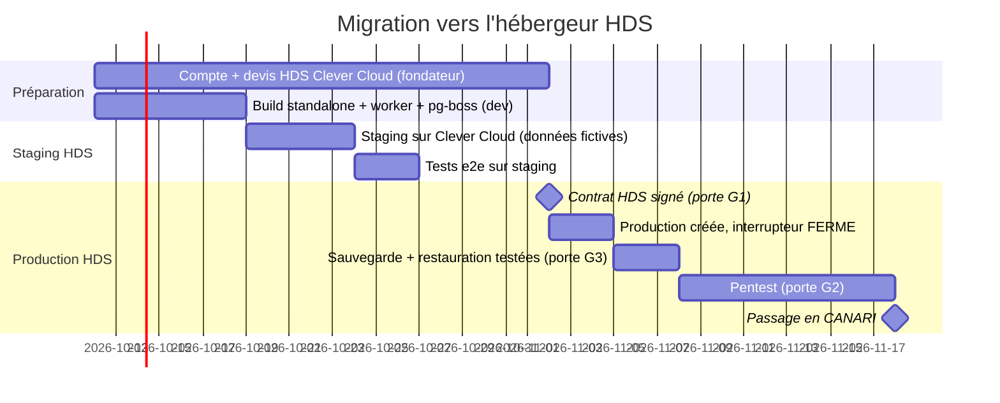

Étapes :
1. Ajouter `output: "standalone"` et un script de démarrage du worker. Garder le build Vercel pour la démo.
2. Créer `staging` sur Clever Cloud **dès le sprint 0** (données fictives). Tous les tests e2e tournent dessus.
3. Signer le contrat HDS (fondateur). Créer `production` avec l'interrupteur `FERME`.
4. Appliquer les migrations Prisma (`prisma migrate deploy`) au démarrage, avec un verrou.
5. Tester la restauration d'une sauvegarde. Lancer le pentest. Passer en `CANARI`.
6. **Aucune** copie de la base démo vers la production. Les comptes opérateurs se recréent à la main (`pnpm ops:create-operator`).

### 12.3 Pourquoi Next.js reste (et pas NestJS)

L'ADR 0001 § 5 prévoyait NestJS avant le pilote. La V1 **garde Next.js full-stack + un worker**. Raisons : le domaine est déjà testé, l'équipe est petite, un monolithe Next.js + worker couvre les besoins V1 (API `/api/v1`, webhooks, tâches). On réévalue si l'équipe dépasse 5 développeurs ou si l'API mobile devient le canal principal. Voir ADR 0007.

---

## 13. Sécurité

| Domaine | Mesure V1 | Origine |
|---|---|---|
| Opérateurs | **TOTP obligatoire**, codes de secours, session de 12 h, IP et appareil journalisés | BL-8, P15 |
| Accès aux données sensibles | Lecture d'un Kayé ou d'un incident par un opérateur = **« bris de glace »** : motif obligatoire, audit, alerte au DPO | `docs/05` § 7.4 |
| Cloisonnement | **RLS PostgreSQL** par cercle et par rôle, en plus des contrôles applicatifs (`canAccessAine`) | BL-18 |
| Chiffrement des champs | AES-256-GCM par enveloppe : nom complet, téléphone et adresse de l'aîné, note du Kayé, incidents, justificatifs. Clé de données par aîné, clé maître versionnée | `docs/05` § 7.4 |
| Données de santé isolées | Schéma PostgreSQL `sante` (Kayé, incidents). Accès seulement par le module `src/server/sante/` | Règle « données de santé isolées » |
| Accès après mission | Accès de l'accompagnant à l'aîné : mission active + 30 jours | BL-15 |
| Code du domicile | Jeton signé et tournant (QR), plus de code fixe | BL-16 |
| Webhooks | Signature vérifiée (Stripe, Meta, Twilio, Brevo), horodatage < 5 min, idempotence | ADR 0004, 0005 |
| CSP | CSP à nonce par le middleware (plus de `unsafe-inline`) | BL-2 |
| Invitations Lakou | Réservées au payeur ; jeton jamais renvoyé aux autres membres | BL-7 |
| Secrets | Aucun secret dans le dépôt (gitleaks en CI), dépôt **privé**, rotation tous les 6 mois | BL-6 |
| Dépendances | `pnpm audit` et Renovate en CI ; SAST Semgrep | `docs/05` § 7.4 |
| Paiement | Aucune donnée de carte chez Koudmen (Stripe Checkout, niveau PCI SAQ A) | ADR 0004 |
| E-mail | SPF, DKIM, DMARC (`p=quarantine` puis `reject`) sur le domaine | — |
| Pentest | Externe, avant `CANARI` (porte G2), puis chaque année | `docs/05` § 7.4 |
| Sauvegardes | Quotidiennes, chiffrées, 30 jours, restauration testée chaque trimestre | `docs/05` § 7.5 |
| Plan de continuité | Hébergement en Hexagone (hors zone cyclonique) ; repli SMS + voix si les données mobiles tombent | `docs/05` § 7.5 |

---

## 14. Points d'entrée pour le design

Le design n'est **pas** décrit ici. Les points d'entrée ci-dessous permettent de l'intégrer sans changer le code métier.

| Point d'entrée | Fichier ou endroit | Ce que le design fournit |
|---|---|---|
| Jetons de design (couleurs, typo, espacements, clair et sombre) | `plateforme/src/app/globals.css` (variables CSS) | Nouvelles valeurs de `docs/design/` |
| Composants de base | `plateforme/src/components/ui/**` | Boutons, champs, cartes, bandeaux |
| Icônes et écran de démarrage PWA | `plateforme/public/icons/**`, `manifest.webmanifest` (`theme_color`, `background_color`) | Icônes 192, 512, maskable, Apple touch |
| Écrans nouveaux (V1) | Liste ci-dessous | Maquettes |
| E-mails | `src/server/notifications/templates/email/**` | Gabarit HTML de l'e-mail |
| Messages vocaux | `voix/v1/**` | Texte validé + enregistrements |

Écrans nouveaux à dessiner : vérification de l'e-mail ; code SMS ; choix des canaux ; « Mes données » ; demande de consentement (côté famille) et suivi ; situation juridique et justificatif ; réservation de la visio (accompagnant) ; formation et QCM ; formules + paiement + résiliation ; relevé d'heures ; invite d'installation (Android, iOS) ; écran hors ligne ; scanner QR ; SOS ; écrans opérateur (interrupteur de lancement, portes, vérifications en visio, appels de bienvenue, incidents, remboursement).

---

## 15. RGPD réel

### 15.1 Gouvernance

- **DPO externalisé** désigné avant `PILOTE` (porte G6).
- **AIPD** complète : personnes vulnérables, données de santé, géolocalisation, appels automatiques, détection d'abus.
- **Registre** des traitements (un traitement par finalité : compte, consentement, visites et preuve, Kayé, notifications, voix, paiement, vérifications, incidents, mesure).
- **Procédure de violation** : notification à la CNIL sous 72 h. Fiche réflexe dans le runbook d'astreinte.
- **Contrats de sous-traitance (DPA)** signés avec chaque fournisseur.

### 15.2 Sous-traitants et transferts

| Sous-traitant | Données | Lieu | Garantie |
|---|---|---|---|
| Clever Cloud | Toutes (production) | France | HDS, DPA |
| Stripe | Payeur : nom, e-mail, paiement | Irlande / États-Unis | DPA, DPF, clauses types |
| Meta (WhatsApp) | Téléphone, texte sans santé | UE / États-Unis | DPA, DPF [À VÉRIFIER] |
| Brevo | E-mail, téléphone, texte sans santé | France | DPA |
| Twilio | Téléphone de l'aîné, touches tapées | États-Unis / UE | DPA, DPF, BCR [À VÉRIFIER] |
| Sentry (région UE) | Erreurs, **sans donnée personnelle** (filtrage) | Allemagne | DPA |
| Vercel + Neon | Démo seulement (fictif) | UE / États-Unis | DPA |
| Expo (V2) | Jetons push | États-Unis | DPA, contenu sans donnée personnelle |

### 15.3 Durées de conservation

| Donnée | Durée | Action |
|---|---|---|
| Copie d'une pièce d'identité ou du B3 | **Jamais stockée** | — |
| Justificatif de mesure de protection | 30 jours après la vérification | Suppression du fichier, on garde le résultat |
| Résultat de vérification | Relation + 5 ans | Suppression |
| Kayé | 12 mois consultables, puis suppression à 13 mois (sauf incident ou litige) | Tâche de purge mensuelle |
| Preuve de visite (distance arrondie, facteurs) | 12 mois | Suppression |
| Statut des appels (durée, touche) | 12 mois | Suppression |
| Messages (journal de remise) | 12 mois | Suppression du corps ; on garde la trace 3 ans [À VÉRIFIER] |
| Factures et paiements | 10 ans | Archive |
| Incidents P1-P2 | Clôture + 5 ans | Suppression |
| Compte inactif | 24 mois après la dernière activité | Préavis par e-mail, puis suppression |
| Journaux de sécurité | 12 mois | Rotation |

### 15.4 Droits des personnes

- **Famille et accompagnant** : écran « Mes données » (§ 4.5).
- **Aîné** : demande par téléphone (ligne entrante, touche dédiée) ou par un opérateur. Lecture du Kayé **par téléphone** possible (opérateur). Notice **FALC** + version audio.
- L'aîné peut **exclure un membre** du cercle (§ 5.3).

---

## 16. Observabilité

| Besoin | Outil V1 | Règle |
|---|---|---|
| Erreurs | Sentry (région UE) | Filtre des données personnelles avant envoi (`beforeSend`). Pas de corps de requête |
| Journaux | Journaux Clever Cloud → Grafana Cloud UE ou Better Stack UE [À VÉRIFIER région] | Journaux JSON structurés. Pas de téléphone, pas d'e-mail en clair (empreinte) |
| Disponibilité | Sonde externe sur `/api/sante` toutes les minutes | Alerte SMS + e-mail à l'astreinte |
| Métriques métier | Table `MetricDaily` + tableau opérateur | Voir ci-dessous |
| Traces | OpenTelemetry en V1.1 | — |

Métriques métier suivies chaque jour, avec seuil d'alerte :

| Métrique | Seuil d'alerte [À VÉRIFIER] |
|---|---|
| Taux d'échec d'envoi WhatsApp / SMS / e-mail | > 5 % sur 1 h |
| Taux de réponse à l'IVR de confirmation | < 50 % sur 7 jours |
| Taux de touche 2 (« personne n'est venu ») | > 2 % |
| Visites `A_VERIFIER` | > 10 % sur 7 jours |
| Tâches en retard dans la file pg-boss | > 50 ou plus vieille que 15 min |
| Webhooks rejetés (signature) | > 0 |
| Paiements échoués | > 10 % des renouvellements |
| Incidents P1-P2 ouverts sans prise en charge | > 0 après le délai |

---

## 17. Modèle de données : ajouts V1

Le schéma du MVP reste la base. La V1 ajoute ou change les éléments suivants. L'architecte écrit **toute** la migration au sprint 0 (comme au MVP), pour que les équipes travaillent en parallèle.

```mermaid
erDiagram
  User ||--o{ ChannelOptIn : "canaux"
  User ||--o{ PushSubscription : "appareils"
  User ||--o| BillingCustomer : "client Stripe"
  User ||--o{ AuthToken : "vérif. e-mail, mot de passe, OTP"
  Aine ||--o{ ConsentRecord : "consentements"
  Aine ||--o| Subscription : "formule"
  Aine ||--o{ VoiceCall : "appels"
  Aine ||--o{ HoursStatement : "relevés"
  Subscription ||--o{ BillingInvoice : "factures"
  Visit ||--o{ VoiceCall : "confirmation"
  Visit ||--o{ VisitEvent : "événements hors ligne"
  Visit ||--o{ Incident : "incidents"
  CaregiverProfile ||--o{ VerificationItem : "vérifications"
  OutboxMessage ||--o{ DeliveryAttempt : "tentatives"
  LaunchGate }o--|| AppSetting : "interrupteur"

  ConsentRecord {
    string id PK
    ConsentScope scope
    ConsentMethod method "APPEL_HUMAIN|IVR|REPRESENTANT"
    LegalSituation legalSituation
    string givenByName
    string operatorId
    string noticeVersion
    string providerCallRef
    datetime givenAt
    datetime revokedAt
  }
  VoiceCall {
    string id PK
    VoicePurpose purpose "CONFIRMATION_VISITE|CONSENTEMENT|KOZE|ENTRANT"
    string provider
    string providerCallId UK
    VoiceStatus status
    string digits
    int attempt
    int durationSec
  }
  Subscription {
    Plan plan
    SubscriptionStatus status
    string stripeSubscriptionId UK
    string stripePriceId
    datetime currentPeriodEnd
    bool cancelAtPeriodEnd
  }
  WebhookEvent {
    string provider
    string eventId UK
    datetime receivedAt
    datetime processedAt
    string error
  }
  HoursStatement {
    string missionId
    string month "AAAA-MM"
    int provenMinutes
    int toCheckMinutes
    datetime familyValidatedAt
  }
  Incident {
    IncidentLevel level "P1-P4"
    IncidentSource source
    IncidentStatus status
    bytes detailsEnc "schéma sante"
  }
  LaunchGate {
    string code UK "G1-G10"
    string evidenceRef
    string checkedById
    datetime checkedAt
  }
  AppSetting {
    LaunchState launchState
    string[] canaryAllowlist
  }
```

Autres changements :
- `User` : `emailVerifiedAt`, `phoneEnc`, `phoneVerifiedAt`, `timezone`, `totpSecretEnc`, `totpEnabledAt`, `recoveryCodesHash[]`, `lastLoginAt`.
- `Aine` : `status` (BROUILLON, ATTENTE_CONSENTEMENT, ACTIF, A_REVOIR, REFUSE, RETIRE), `legalSituation`, `fullNameEnc`, `phoneEnc`, `addressEnc`, `homeLatRounded`, `homeLngRounded`, `callLanguage`, `apaStatus`, `territory` (MQ, GP), `kozeSlot`. Les champs `consentGiven`, `consentByType`, `consentByName` du MVP sont remplacés par `ConsentRecord`.
- `LakouMember` : `kayeAccess` (choix de l'aîné).
- `VerificationItem` : `method`, `checkedById`, `checkedAt`, `expiresAt`, `resultNote` (liste fermée), `providerRef`.
- `OutboxMessage` : `intent`, `dedupeKey` (unique), `provider`, `providerMessageId`, statuts `EN_ATTENTE`, `ENVOYE`, `REMIS`, `LU`, `ECHEC`, `BLOQUE` (interrupteur), `fallbackOfId`.
- `VisitProof` : on retire `latitude` et `longitude` bruts ; on garde `distanceMetersRounded` et `valid` (P7).
- `JournalEntry` : déplacé dans le schéma `sante`, `noteEnc`.
- `Sandbox`, `UsageEvent`, `MicroAnswer`, `DiscoveryRequest` : gardés pour `demo` seulement.

---

## 18. Modules du monolithe

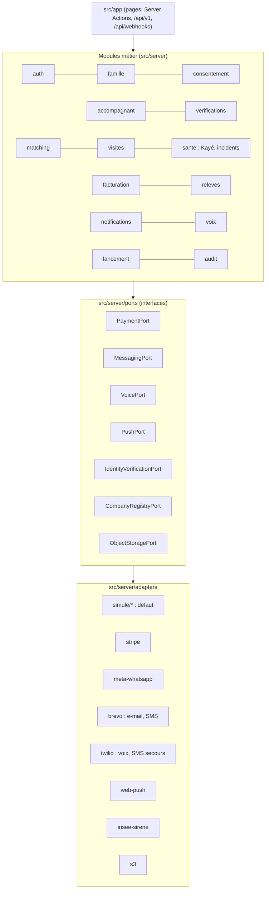

### 18.1 Les adaptateurs

Chaque port a **une implémentation simulée** (défaut) et une ou plusieurs implémentations réelles. Le choix se fait par variable d'environnement.

| Port | Variable | Valeurs | Simulé fait quoi |
|---|---|---|---|
| `PaymentPort` (abonnement) | `ADAPTER_PAYMENT` | `simule` \| `stripe` | Crée un paiement `SimulatedPayment`, active la formule |
| `HoursPaymentPort` | — | `hors_plateforme` (seule valeur) | Rien (relevé seulement) |
| `MessagingPort` WhatsApp | `ADAPTER_WHATSAPP` | `simule` \| `meta` | Écrit l'Outbox `ENVOYE_SIMULE` |
| `MessagingPort` SMS | `ADAPTER_SMS` | `simule` \| `brevo` \| `twilio` \| `ovh` | Idem |
| `MessagingPort` e-mail | `ADAPTER_EMAIL` | `simule` \| `brevo` \| `smtp` | Idem + aperçu dans l'espace opérateur |
| `VoicePort` | `ADAPTER_VOICE` | `simule` \| `twilio` \| `vonage` | Crée un `VoiceCall` ; un bouton opérateur (demo, staging) simule la touche |
| `PushPort` | `ADAPTER_PUSH` | `simule` \| `webpush` | Outbox |
| `IdentityVerificationPort` | `ADAPTER_IDENTITY` | `manuel` \| `ubble` \| `idnow` | Contrôle humain en visio |
| `CompanyRegistryPort` | `ADAPTER_SIRENE` | `simule` \| `insee` | Répond « actif » pour les SIRET de test |
| `ObjectStoragePort` | `ADAPTER_STORAGE` | `local` \| `s3` | Dossier local chiffré |

Règles :
1. `config-check.ts` refuse un adaptateur simulé si `KOUDMEN_ENV=production` et `launchState ≠ FERME`.
2. `config-check.ts` refuse un adaptateur réel si `KOUDMEN_ENV=demo`.
3. Chaque adaptateur réel a un **test de contrat** qui tourne contre le bac à sable du fournisseur (Stripe test, numéro de test Twilio), lancé à la main.

### 18.2 Contrats d'API (V1)

API JSON versionnée, pour la PWA hors ligne aujourd'hui et pour Expo demain. Authentification : cookie de session (web) ou jeton `Bearer` (mobile, V2). Validation Zod. Erreurs au format `{ error: { code, message } }`.

| Méthode | Route | Rôle | Usage |
|---|---|---|---|
| GET | `/api/v1/moi` | Tous | Profil, rôle, droits, préférences |
| GET | `/api/v1/accompagnant/visites?du=&au=` | Accompagnant | Visites (7 jours) pour le cache hors ligne |
| POST | `/api/v1/visites/{id}/evenements` | Accompagnant | Lot d'événements hors ligne (`CHECK_IN`, `PREUVE_GPS`, `PREUVE_CODE`, `CHECK_OUT`), idempotent par `clientEventId` |
| PUT | `/api/v1/visites/{id}/kaye` | Accompagnant | Kayé (idempotent) |
| GET | `/api/v1/accompagnant/propositions` | Accompagnant | Propositions en attente |
| POST | `/api/v1/propositions/{id}/reponse` | Accompagnant | `{ decision: ACCEPTE \| REFUSE, note? }` |
| POST | `/api/v1/sos` | Accompagnant | Déclenche un incident P1 |
| GET | `/api/v1/famille/fil` | Famille | Kayé et visites (selon `kayeAccess`) |
| POST | `/api/v1/push/abonnements` | Tous | `{ type: WEBPUSH \| EXPO, ... }` |
| DELETE | `/api/v1/push/abonnements/{id}` | Tous | Désabonnement |
| POST | `/api/webhooks/stripe` | Stripe | Événements de paiement |
| GET, POST | `/api/webhooks/whatsapp` | Meta | Vérification + statuts + messages entrants |
| POST | `/api/webhooks/voix/twilio/{script\|resultat\|statut}` | Twilio | Script TwiML, touches, statuts |
| POST | `/api/webhooks/brevo` | Brevo | Statuts e-mail et SMS |

Le document OpenAPI est généré depuis les schémas Zod (`/api/v1/openapi.json`, en `staging` seulement).

---

## 19. Questions ouvertes

1. [À VÉRIFIER AVOCAT] DAC7 et précompte 2027 s'appliquent-ils quand les heures sont payées hors plateforme ?
2. [À VÉRIFIER AVOCAT] Formation obligatoire pour l'AE (D9 contre P11).
3. [À VÉRIFIER ARCEP / opérateur] Numéro 0596 / 0590 pour des appels automatiques : autorisé, ou tranche dédiée obligatoire ?
4. [À VÉRIFIER DPO] Consentement par appel sans enregistrement audio : preuve suffisante ?
5. [À VÉRIFIER DPO] Prénom de l'aîné dans un message WhatsApp : acceptable ?
6. [À VÉRIFIER EXPERT-COMPTABLE] Taux de TVA de l'abonnement (siège en Martinique ou en Hexagone, payeur en Hexagone).
7. [À VÉRIFIER Meta] Tarif WhatsApp pour les indicatifs +596 / +590.
8. [À VÉRIFIER fondateur] Contenu et prix final des formules Kozé et Sérénité.
9. [À VÉRIFIER Clever Cloud] Le stockage objet Cellar est-il dans le périmètre HDS ?
