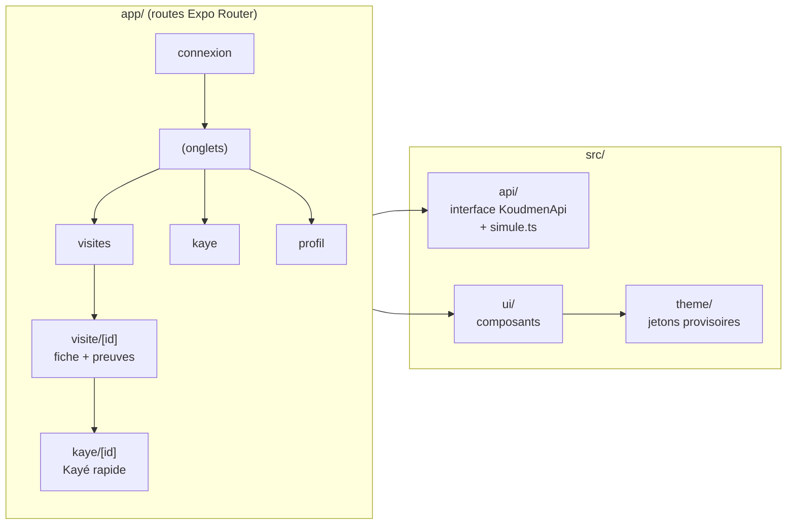

# Koudmen — app mobile (accompagnant)

Lot **M1** de l'ADR 0008 : squelette Expo, données **simulées**.
Expo SDK 57 · React Native 0.86 · Expo Router · TypeScript strict.

## Lancer sur un vrai téléphone (Expo Go)

1. Installez **Expo Go** sur le téléphone (App Store ou Google Play).
2. Sur l'ordinateur, dans `mobile/` :
   ```bash
   npm install
   npx expo start
   ```
3. Scannez le QR code :
   - iPhone : avec l'appareil photo ;
   - Android : avec Expo Go.
4. Le téléphone et l'ordinateur doivent être sur le **même Wi-Fi**. Sinon : `npx expo start --tunnel`.

Connexion de démonstration :
- numéro : n'importe quel numéro de 9 chiffres ou plus ;
- code SMS : **123456** ;
- code du domicile (saisie à la main) : **4821**.

## Vérifier sans téléphone

```bash
npx tsc --noEmit                 # types
npx expo export -p web           # export web dans dist/
npm run e2e                      # Playwright, 390 px (serveur statique e2e/serve.mjs)
SHOTS_DIR=/chemin npm run e2e -- captures   # captures clair et sombre
```

Dans la sandbox : `PLAYWRIGHT_BROWSERS_PATH=/opt/pw-browsers` (Chromium préinstallé, `@playwright/test` 1.56.1).
Si l'API Expo est bloquée par le proxy : préfixez par `EXPO_OFFLINE=1`.

## Structure



| Dossier | Rôle |
|---|---|
| `app/` | Écrans (une route par fichier). Pas de logique métier. |
| `src/api/` | `KoudmenApi` (interface) + `simule.ts`. Le lot M2 ajoute `http.ts` vers `/api/v1`. |
| `src/theme/` | Thème **provisoire** tiré de `docs/design/direction-artistique.md`. À remplacer par la sortie de `design/tokens.json` (lot W1). |
| `src/ui/` | Composants : `Button`, `Card`, `Badge`/`ProofBadge`, `Avatar` (anneau madras), `Choice`, `SwitchRow`, `Field`, `TabBar`, `Screen` (pied d'action), illustrations. |
| `src/visites/` | Règles d'affichage des visites (2 preuves sur 3). |
| `e2e/` | Playwright sur l'export web. |
| `src/contracts/` | **Absent exprès** : généré au lot M2 (`scripts/sync-contracts.mjs`). |

## Règles respectées

- Position : une seule lecture à l'arrivée, avec accord. Jamais en arrière-plan.
- Pas de téléphone de l'aîné ni d'historique de Kayé sur l'appareil.
- Cibles tactiles ≥ 44 px (boutons principaux 56–60 px), `accessibilityLabel` sur chaque bouton-icône, rôles `tab`, `radio`, `switch`.
- Thème clair et sombre (suit le système, choix manuel dans Profil).

## Limites du lot M1

- Données en mémoire : tout revient à zéro au redémarrage.
- Pas de vraie position, pas de scan (lot M4), pas de hors ligne (lot M3), pas de push (lot N1).
- Le choix du thème n'est pas mémorisé.
- Graphie créole (« Bonjou », « Sa ka maché », « Mèsi anpil », « Bon travay ») : [À VÉRIFIER] avec un locuteur.
