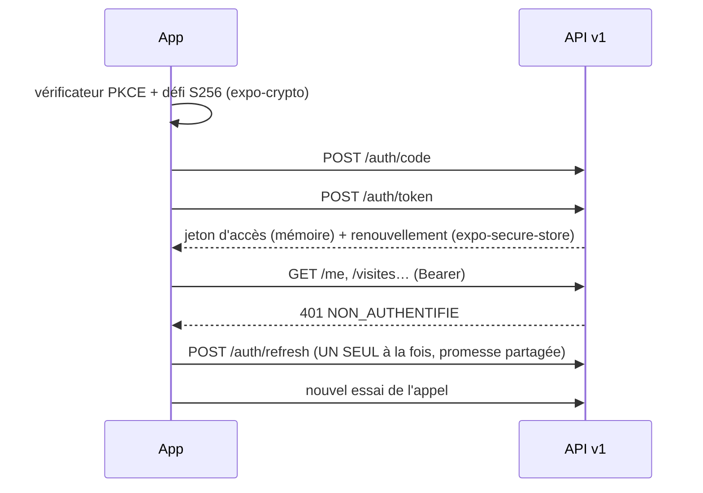
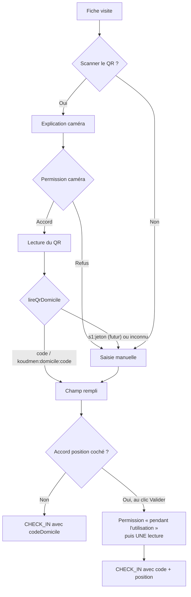
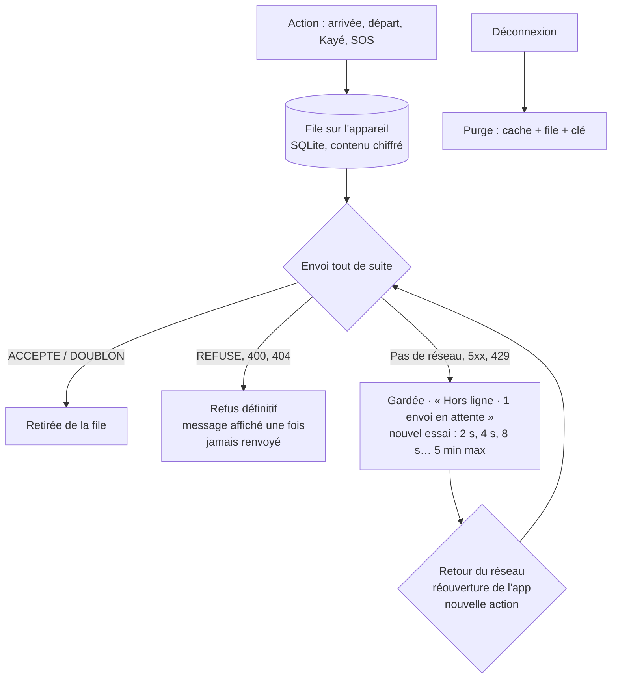
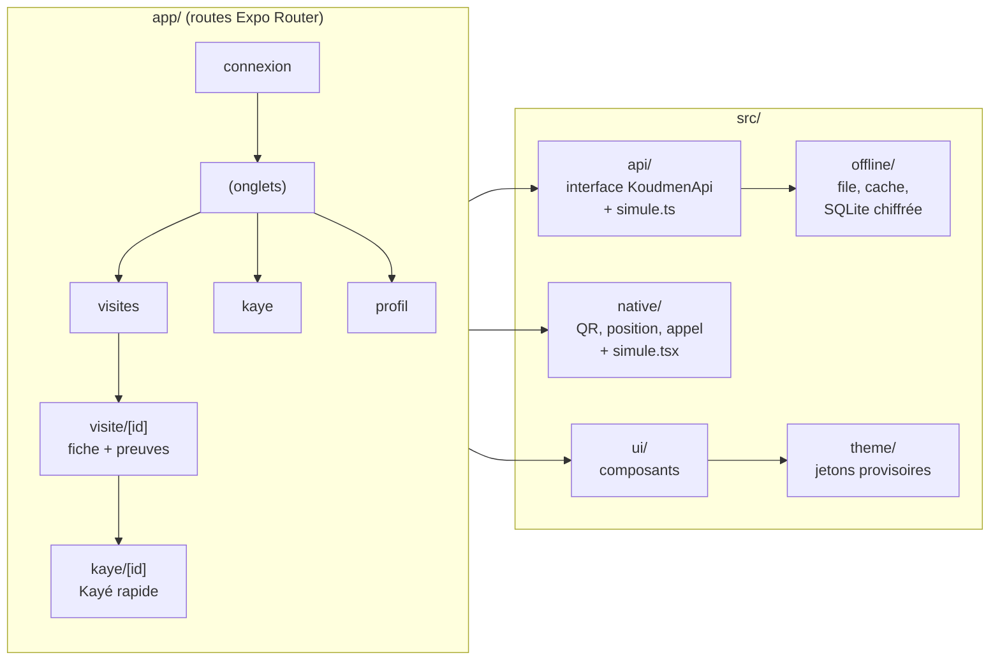

# Koudmen — app mobile (accompagnant)

Lots **M1** (squelette), **M2** (connexion et visites réelles), **M3** (hors ligne) et **M4** (QR, position ponctuelle, SOS) de l'ADR 0008.
Expo SDK 57 · React Native 0.86 · Expo Router · TypeScript strict · contrats Zod de l'API v1.

## Choisir la source des données

| Variable | Valeur | Effet |
|---|---|---|
| `EXPO_PUBLIC_API_URL` | `http://localhost:3000` (défaut) | API v1 de `plateforme/` |
| `EXPO_PUBLIC_API_URL` | `/` | même origine (export web + `scripts/proxy-dev.mjs`) |
| `EXPO_PUBLIC_API_MODE` | `simule` | démo hors ligne, données en mémoire (capteurs simulés aussi) |
| `EXPO_PUBLIC_NATIF` | `simule` / `reel` | force les capteurs simulés, ou les vrais capteurs avec l'API simulée |

Repli : `expo.extra.apiUrl` / `expo.extra.apiMode` dans un `app.config`.
Les variables `EXPO_PUBLIC_*` sont figées au build : ajoutez `--clear` si vous changez de valeur (cache Metro).

## Lancer sur un vrai téléphone (Expo Go)

1. Installez **Expo Go**. Le téléphone et l'ordinateur sont sur le **même Wi-Fi**.
2. Lancez `plateforme/` (`DEMO_MODE=true`), puis dans `mobile/` :
   ```bash
   npm install
   EXPO_PUBLIC_API_URL=http://<IP-de-l-ordinateur>:3000 npx expo start
   ```
3. Scannez le QR code. Connexion : `accompagnant@demo.koudmen.test` et `DEMO_PASSWORD` de `plateforme/.env`,
   ou le lien « Essayer avec le compte de démonstration ».

Sans serveur : `EXPO_PUBLIC_API_MODE=simule npx expo start` (mot de passe `koudmen`, code du domicile `KDM482`).

### Essayer la caméra et la position réelles (lot M4)

`expo-camera` et `expo-location` sont inclus dans Expo Go : pas besoin de build pour un premier essai.

1. Sans serveur, avec les **vrais** capteurs :
   ```bash
   EXPO_PUBLIC_API_MODE=simule EXPO_PUBLIC_NATIF=reel npx expo start --clear
   ```
2. Ouvrez une visite du jour → **Scanner le QR code** → « Autoriser la caméra ».
3. Visez un QR qui contient `koudmen:domicile:KDM482` (ou `KDM482`). Pour en créer un :
   `npx qrcode-terminal "koudmen:domicile:KDM482"` [À VÉRIFIER : outil non installé], ou tout générateur de QR.
4. Activez « Partager ma position, une fois », puis **Valider mon arrivée** : le téléphone demande l'accès
   « pendant l'utilisation de l'app ». Une seule lecture a lieu, à ce moment.
5. SOS → « Appeler le 15 / 112 » ouvre le composeur du téléphone. **N'appelez pas** pendant un essai.

Limites d'Expo Go :
- Les textes des invites système sont ceux d'Expo Go, pas ceux de `app.json`.
  Les textes Koudmen (`NSCameraUsageDescription`, `NSLocationWhenInUseUsageDescription`) apparaissent seulement
  dans un build (`npx eas-cli@latest build --profile development`), à faire au premier build EAS (ADR 0008).
- Pour rejouer l'invite après un refus : supprimez les autorisations d'Expo Go dans les réglages du téléphone.

## Connexion et jetons (lot M2)



- Pas de délai de grâce côté serveur : deux renouvellements simultanés révoqueraient la connexion. `src/api/http.ts` les sérialise.
- `JETON_INVALIDE` / `JETON_REUTILISE` : jetons effacés, retour à la connexion avec un message.
- Web : le jeton de renouvellement reste **en mémoire** (recharger la page demande de se reconnecter).
- Événements (`POST /evenements`) : un `clientEventId` neuf par action. Ils passent par la file hors ligne (lot M3) : chaque renvoi garde le même identifiant (idempotent).
- Position : une lecture au check-in, avec accord. Web : API du navigateur. iOS / Android : `expo-location` (lot M4).

## Arrivée avec QR et position (lot M4)



| Format du QR | Effet |
|---|---|
| `KDM482` | Code lisible (QR actuels) |
| `koudmen:domicile:KDM482` | Code lisible (format v1 à imprimer) |
| `koudmen:domicile:s1:<jeton>` | Jeton signé futur : reconnu, message « pas encore accepté » |

## Hors ligne (lot M3)

L'accompagnant travaille souvent sans réseau (mornes, maisons en béton). L'app garde ses actions et les envoie plus tard.



| Règle | Détail |
|---|---|
| Ordre | Un événement à la fois, dans l'ordre d'arrivée. **Exception : le SOS passe devant.** |
| Doublons | Renvoi avec le **même** `clientEventId` : le serveur répond `DOUBLON` (api-v1 § 9.2). Double appui sur « Départ » ou « SOS » : une seule ligne. Kayé corrigé : le dernier texte part. |
| Erreur réseau | `RESEAU`, `5xx`, `429`, réponse illisible, `DOUBLON`/`EN_COURS` : arrêt de la file (l'ordre est gardé), attente progressive. |
| Erreur définitive | `REFUSE` (motif du serveur), `400`, `404`, `413` : l'événement n'est plus envoyé. Le refus garde le motif et le message, **pas** le contenu du Kayé. |
| Session perdue | La file s'arrête et garde tout. Elle repart à la reconnexion **du même compte**. Autre compte : tout est effacé d'abord. |
| SOS sans réseau | Tentative immédiate. Échec : « l'alerte n'est pas partie », boutons **15** et **112** (écran SOS), envoi au retour du réseau. |
| Écran | Sans réseau, l'action lève `EN_ATTENTE` : le message s'affiche, le texte reste à l'écran, le bandeau compte les envois. |

Cache de lecture : visites **du jour** (pas les 7 jours), leurs fiches (préchargées), le compte (`/me`).
Durée 24 h pour les visites. Chaque lecture repasse par le schéma Zod. Sans réseau au démarrage, l'app rouvre la session
depuis le cache si un jeton de renouvellement est gardé ; le jeton est renouvelé au retour du réseau.

### Chiffrement au repos : choix

| Option | Expo Go | Décision |
|---|---|---|
| SQLCipher (`expo-sqlite`, `useSQLCipher`) | **Non** (propriété de build native) | Écartée pour l'instant |
| SQLite + chiffrement applicatif AES-256-GCM (`expo-crypto`), clé dans `expo-secure-store` | Oui | **Retenue** |

- Chiffré : le contenu de chaque événement (Kayé = donnée de santé, code du domicile, position) et chaque valeur du cache.
- En clair : identifiants opaques, type, compteurs (nécessaires au tri).
- Clé : 256 bits aléatoires, `AFTER_FIRST_UNLOCK_THIS_DEVICE_ONLY`. Déconnexion : lignes effacées (`secure_delete`, `VACUUM`) **et** clé effacée.
- Donnée illisible (clé perdue, réinstallation) : effacée, jamais envoyée.
- Web (export) : **mémoire** seulement, derrière la même interface (`plateforme.ts`). Rien n'est écrit dans le navigateur ;
  recharger la page perd la file (et demande déjà de se reconnecter).
- [À VÉRIFIER] au premier essai sur téléphone : AES de `expo-crypto` dans Expo Go SDK 57, et passage à SQLCipher au premier build EAS (lot E1).

### Vérifier

```bash
npm run test:hors-ligne                    # unitaires : ordre, doublons, reprise, erreurs, purge, chiffrement, cache
EXPO_OFFLINE=1 npm run export:web:hors-ligne
npm run e2e:hors-ligne                     # coupure réseau réelle (context.setOffline), API factice
SHOTS_DIR=/chemin npm run e2e:hors-ligne   # + captures
```

## Contrats

```bash
npm run sync:contracts              # copie plateforme/src/contracts/v1 → src/contracts (sans *.test.ts)
npm run sync:contracts -- --check   # échoue si la copie n'est plus à jour
```

`src/contracts/` est **généré** : ne le modifiez pas à la main.

## Vérifier sans téléphone

```bash
npx tsc --noEmit
# 1. Contre le vrai serveur (critère M2). plateforme/ lancée sur :3731 (DEMO_MODE=true), sans db:seed.
EXPO_OFFLINE=1 npm run export:web:reel
API_CIBLE=http://localhost:3731 npm run e2e
SHOTS_DIR=/chemin npm run e2e         # + captures 390 px clair et sombre
# 2. Démo hors ligne.
EXPO_OFFLINE=1 npm run export:web:simule && npm run e2e:simule
# 3. Lot M4 : décodage du QR (unitaires, sans navigateur), puis fiche avec capteurs simulés.
npm run test:natif
EXPO_OFFLINE=1 npm run export:web:simule && SHOTS_DIR=/chemin npm run e2e:natif
```

Les tests M4 pilotent les adaptateurs simulés avant le chargement de la page :

```ts
await page.addInitScript(() => { (globalThis as any).__KOUDMEN_NATIF__ = { position: 'bloquee', camera: 'accordee', qr: 'KDM482' }; });
// puis : globalThis.__KOUDMEN_NATIF_JOURNAL__ → { lecturesPosition, appels }
```

- **CORS** : l'API v1 n'envoie pas d'en-têtes CORS. `scripts/proxy-dev.mjs` sert l'export web **et** relaie `/api/*` vers `plateforme/` : même origine, `plateforme/` ne change pas. Outil de dev seulement.
- Les e2e créent leurs données sur le compte démo (`e2e/reel/donnees.ts`, client Prisma de `plateforme/`), puis les effacent. Ils remettent à zéro les compteurs `login:*` de la base **locale**.
- Sandbox : `PLAYWRIGHT_BROWSERS_PATH=/opt/pw-browsers` (Chromium préinstallé, `@playwright/test` 1.56.1).

## Structure



| Dossier | Rôle |
|---|---|
| `app/` | Écrans (une route par fichier). Pas de logique métier. |
| `src/api/` | `KoudmenApi` (interface), `http.ts` (API v1, jetons, PKCE), `simule.ts` (hors ligne), `position.ts`. |
| `src/session/` | `SessionProvider` (reprise au démarrage, session perdue), navigation. |
| `src/contracts/` | **Généré** par `scripts/sync-contracts.mjs`. |
| `scripts/` | `sync-contracts.mjs`, `proxy-dev.mjs`. |
| `src/theme/` | Thème **provisoire** tiré de `docs/design/direction-artistique.md`. À remplacer par la sortie de `design/tokens.json` (lot W1). |
| `src/ui/` | Composants : `Button`, `Card`, `Badge`/`ProofBadge`, `Avatar` (anneau madras), `Choice`, `SwitchRow`, `Field`, `TabBar`, `Screen` (pied d'action), illustrations. |
| `src/native/` | Lot M4. Interface `Natif` (`types.ts`) : `position` (`position.native.ts` = expo-location, `position.ts` = navigateur), `scanner` (`VueScanner.tsx`, expo-camera), `appel` (`tel:`). `codeDomicile.ts` décode le QR. `simule.tsx` pour la démo et les tests. |
| `src/offline/` | Lot M3. `file.ts` (file d'événements), `cache.ts`, `chiffre.ts`, `horsligne.ts` (assemblage), `plateforme.native.ts` (SQLite + AES-GCM) / `plateforme.ts` (web, mémoire), `reseau.ts` (expo-network + AppState), `BandeauHorsLigne.tsx`. |
| `src/visites/` | Règles d'affichage des visites (2 preuves sur 3). |
| `e2e/` | Playwright sur l'export web : `reel/` (vrai serveur), `simule/` (hors ligne). |

## Règles respectées

- Position : une seule lecture à l'arrivée, avec accord. Jamais en arrière-plan.
  Permission « pendant l'utilisation » seulement : `app.json` bloque `ACCESS_BACKGROUND_LOCATION` et n'a pas de texte « Always ».
- Caméra : lecture du QR seulement, aucune photo gardée, micro jamais demandé (`RECORD_AUDIO` bloquée).
- SOS : aucune position envoyée. Appels 15 et 112 proposés avant et après l'alerte.
- Pas de téléphone de l'aîné ni d'historique de Kayé sur l'appareil.
- Cibles tactiles ≥ 44 px (boutons principaux 56–60 px), `accessibilityLabel` sur chaque bouton-icône, rôles `tab`, `radio`, `switch`.
- Thème clair et sombre (suit le système, choix manuel dans Profil).

## Limites

- Hors ligne (M3) : après un Kayé gardé, l'écran reste sur le formulaire (message + bandeau). Un nouvel appui après l'envoi réel donne un refus « déjà envoyé » (affiché dans le bandeau). Un écran « Kayé gardé » dédié serait plus clair (`app/kaye/[id].tsx`).
- Hors ligne (M3) : un check-in gardé ne change pas la fiche avant l'envoi (pas d'état optimiste).
- Pas de push (lot N1).
- QR signé (`koudmen:domicile:s1:<jeton>`) : reconnu mais pas encore envoyé, le serveur n'accepte que le code lisible (api-v1 § 9.7).
- Web : le scan demande `BarcodeDetector` (Chrome Android oui, Safari iOS non) ; sinon saisie manuelle seulement.
- Invites caméra et position avec les textes Koudmen : à vérifier au premier build EAS (Expo Go affiche les siens).
- `aine.interets` est vide côté serveur (api-v1 § 9.7) : pas de puces de centres d'intérêt pour l'instant.
- La confirmation de l'aîné (« tapez 1 ») se fait côté serveur : l'app l'affiche seulement.
- Le choix du thème n'est pas mémorisé.
- Graphie créole (« Bonjou », « Sa ka maché », « Mèsi anpil », « Bon travay ») : [À VÉRIFIER] avec un locuteur.
